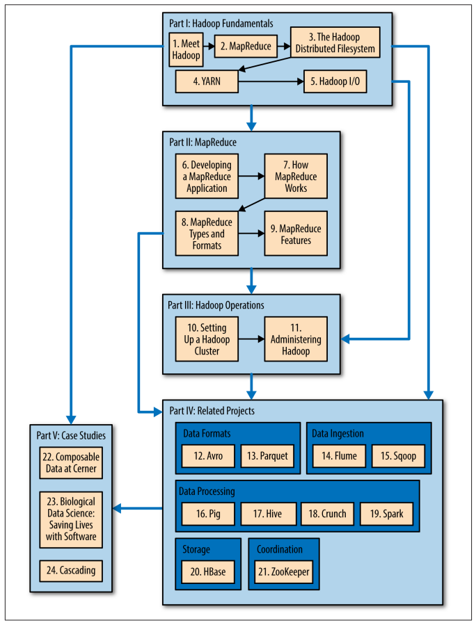

# Chapter 1. Meet Hadoop

## Data!

"More data usually beats better algorithm"

## Data Storage and Analysis

The first problem to solve is hardware failure: as soon as you start using many pieces of hardware, the chance that one
will fail is fairly high. A common way of avoiding data loss is through replication: redundant copies of data are kept
by the system so that in the event of failure, there is another copy available.

The second problem is that most analysis tasks need to be able to combine the data in some way, and data read from one
disk may need to be combined with data from any of the other 99 disks. MapReduce provides a programming model that
abstracts the problem from disk reads and writes, transforming it into a computation over sets of keys and values.

## Querying All Your Data

The premise is that the entire dataset - or at least a good portion of it - can be processed for each query. MapReduce
is a _batch_ query processor, and the ability to run ad hoc query against your whole dataset and get the results in a
reasonable time is transformative.

## Beyond Batch

For all its strength, MapReduce is fundamentally a batch processing system, and is not suitable for interactive
analysis.

The term "Hadoop" is sometimes used to refer to a larger ecosystem of projects, not just HDFS and MapReduce, that fall
under the umbrella of infrastructure for distributed computing and large-scale data processing.

- HBase: A key-value store that uses HDFS for its underlying storage. HBase provides both online read/write access of
  individual rows and batch operations for reading and writing data in bulk, making it a good solution for building
  application on.
- YARN: A cluster resource management system allows any distributed program to run on data in a Hadoop cluster.

Processing patterns work with Hadoop:

- Interactive SQL
- Interactive processing (straightforward with Spark)
- Stream processing (Storm, SPark streaming, Samza)
- Search (The Solr search platform)

## Book structure

