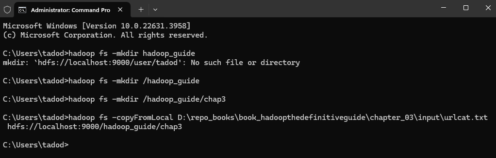
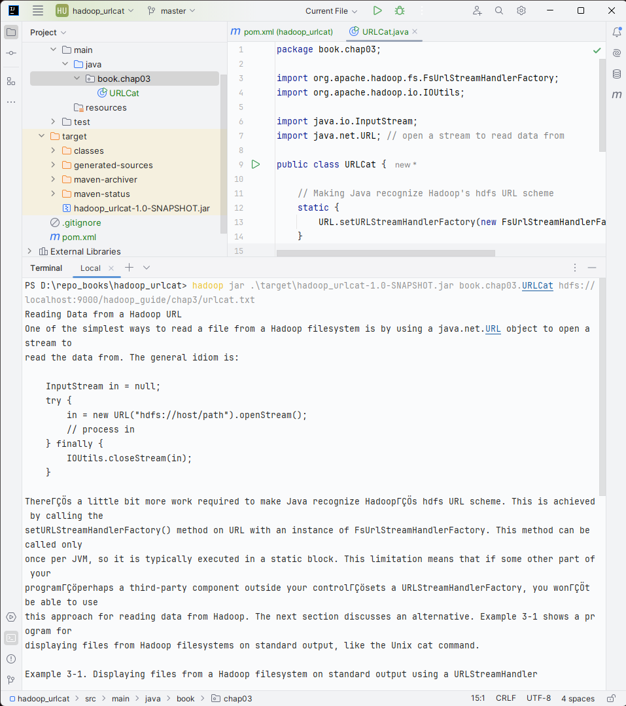
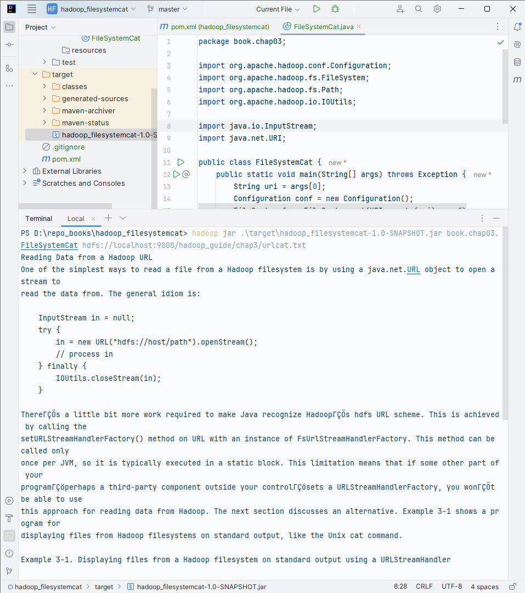

# Chapter 3. The Hadoop Distributed Filesystem

When a dataset outgrows the storage capacity of a single physical machine, it becomes necessary to partition it across a
number of separate machines. Filesystems that manage the storage across a network of machines are called _distributed
filesystems_.

Hadoop comes with a distributed filesystem called HDFS, which stands for _Hadoop Distributed Filesystem_.

## The Design of HDFS

HDFS is a filesystem designed for storing very large files with streaming data access patterns, running on clusters of
commodity hardware.

- _Very large files_: files that are hundreds of megabytes, gigabytes or terabytes in size

- _Streaming data access_: HDFS data processing pattern is a write-once, read-many-times pattern.

- _Commodity hardware_: Hadoop doesn't require expensive, highly reliable hardware. HDFS is designed to carry on working
  without a noticeable interruption to the user in the face of such failure.

Hadoop is not a good fit with:

- Applications require low-latency data access (HBase is better choice than HDFS)

- Lots of small files (a lot of metadata for namenode)

- Multiple writer, arbitrary file modifications

## HDFS Concepts

### Blocks

HDFS has the concept of a block - 128 MB by default. Unlike a filesystem for a single disk, a file in HDFS that is
smaller than a single block does not occupy a full block’s worth of underlying storage. Having a block abstraction for a
distributed filesystem brings several benefits:

- First, a file can be larger than any single disk in the network.

- Second, making the unit of abstraction a block rather than a file simplifies the storage subsystem.

- Third, blocks fit well with replication for providing fault tolerance and availability. To insure against corrupted
  blocks and disk and machine failure, each block is replicated to a small number of physically separate machines (
  typically three).

List the blocks that make up each file in the system (Filesystem check - fsck)

    % hdfs fsck / -files -blocks

### Namenodes and Datanodes

An HDFS cluster has two types of nodes operating in a master-worker pattern: a _namenode_ (the master) and a number of
_datanodes_ (workers).

The namenode manages the filesystem namespace. It maintains the filesystem tree and the metadata for all the files and
directories in the tree (This information on the local disk: the namespace image and the edit log).

Datanodes are the workhorses of the filesystem. They store and retrieve blocks when they are told to (by clients or the
namenode), and they report back to the namenode periodically with lists of blocks that they are storing.

Without the namenode, all the files on the filesystem would be lost since there would be no way of knowing how to
reconstruct the files from the blocks on the datanodes. Hadoop provides two mechanisms for making the namenode resilient
to failure:

- First way: Back up the files that make up the persistent state of the filesystem metadata.

- Second way: Run a _Secondary namenode_. The main role is to periodically merge the namespace image with the edit log
  to prevent the edit log from becoming too large. However, the state of the secondary namenode lags that of the
  primary, so in the event of total failure of the primary, data loss is almost certain.

### Block Caching

Normally a datanode reads blocks from disk, but for frequently accessed files the blocks may be explicitly cached in the
datanode’s memory, in an off-heap _block cache_. Users or applications instruct the namenode which files to cache (and
for how long) by adding a cache directive to a cache pool.

### HDFS Federation

HDFS federation allows a cluster to scale by adding namenodes, each of which manages a portion of the filesystem
namespace.

To access a federated HDFS cluster, clients use client-side mount tables to map file paths to namenodes. This is managed
in configuration using `ViewFileSystem` and the `viewfs://` URIs.

### HDFS High Availability

To recover from a failed namenode in this situation, an administrator starts a new primary namenode with one of the
filesystem metadata replicas and configures datanodes and clients to use this new namenode. The new namenode is not able
to serve requests until it has: (take about 30 minutes)

- Loaded its namespace image into memory
- Replayed its edit log
- Received enough block reports from the datanode to leave safe mode

Hadoop 2 remedied this situation by adding support for HDFS high availability (HA). In this implementation, there are a
pair of namenodes in an active-standby configuration. In the event of the failure of the active namenode, the standby
takes over its duties to continue servicing client requests without a significant interruption.

If the active namenode fails, the standby can take over very quickly (in a few tens of seconds) because it has the
latest state available in memory: both the latest edit log entries and an up-to-date block mapping. The actual observed
failover time will be longer in practice (around a minute or so), because the system needs to be conservative in
deciding that the active namenode has failed.

#### Failover and fencing

The transition from the active namenode to the standby is managed by a new entity in the system called the _failover
controller_. There are various failover controllers, but the default implementation uses ZooKeeper to ensure that only
one namenode is active. Each namenode runs a lightweight failover controller process whose job it is to monitor its
namenode for failures (using a simple heartbeating mechanism) and trigger a failover should a namenode fail.

_Graceful failover_: Failover initiated manually by an administrator.

In the case of an ungraceful failover, however, it is impossible to be sure that the failed namenode has stopped
running. The HA implementation goes to great lengths to ensure that the previously active namenode is prevented from
doing any damage and causing corruption—a method known as fencing.

## The Command-Line Interface

### Basic Filesystem Operations

Detailed on every command

    hadoop fs -help

Copying a file from local filesystem to HDFS

    hadoop fs -copyFromLocal D:\repo_books\book_hadoopthedefinitiveguide\chapter_03\input\urlcat.txt hdfs://localhost:9000/hadoop_guide/chap3

    hadoop fs -copyFromLocal C:\Users\tadod\Documents\Image-Line\FPC\placeholder.txt /hdfs_dir_path

Cutting

    hadoop fs -put C:\Users\tadod\Documents\Image-Line\FPC\placeholder.txt /hdfs_dir_path

Copy the file back to the local filesystem

    hadoop fs -copyToLocal /hdfs_dir_path/quangle.txt C:\quangle.copy.txt

HDFS file listing

    hadoop fs -mkdir books
    hadoop fs -ls .

> File Permissions in HDFS (like POSIX): read (`r`), write (`w`), execute (`x`)

## Hadoop Filesystems

Hadoop has an abstract notion of filesystems, of which HDFS is just one implementation. The Java abstract
`class org.apache.hadoop.fs.FileSystem` represents the client interface to a filesystem in Hadoop, and there are several
concrete implementations.

### Interfaces

Include **HTTP**, **C**, **NFS**, **FUSE**

## The Java Interface

### Reading Data from a Hadoop URL

Using a `java.net.URL` object to open a stream to read the data from

### Reading Data Using the FileSystem API

Sometimes it is impossible to set a `URLStreamHandlerFactory` for your application. In this case, you will need to use
the `FileSystem` API to open an input stream for a file

A file in a Hadoop filesystem is represented by a Hadoop Path object (not `java.io.File` object cuz too closely tied to
the local filesystem). `Path` as a Hadoop filesystem URI, such as `hdfs://localhost:9000/hadoop_guide/chap3/urlcat.txt`

`FileSystem` is a general filesystem API, so the first step is to retrieve an instance for the filesystem we want to
use—HDFS, in this case.

    // Return the default system (specified in _core-site.xml_)
    public static FileSystem get(Configuration conf) throws IOException

    // Use the given URI's scheme, determine the filesystem to use
    public static FileSystem get(URI uri, Configuration conf) throws IOException

    // Retrieve the filesystem as the given user
    public static FileSystem get(URI uri, Configuration conf, String user) throws IOException

A Configuration object encapsulates a client or server’s configuration, which is set using configuration files read from
the classpath, such as _etc/hadoop/core-site.xml_

Some case, retrieve a local filesystem instance

    public static LocalFileSystem getLocal(Configuration conf) throws IOException

With `FileSystem` instance, we invoke `open()` method to get the input stream for a file

    public FSDataInputStream open(Path f) throws IOException // default buffer size of 4 KB
    
    public abstract FSDataInputStream open(Path f, int bufferSize) throws IOException

#### FSDataInputStream

The `open()` method on FileSystem actually returns an `FSDataInputStream` rather than a standard `java.io` class. This
class is a specialization of `java.io.DataInputStream` with support for random access, so you can read from any part of
the stream:

    package org.apache.hadoop.fs;

    public class FSDataInputStream extends DataInputStream implements Seekable, PositionedReadable {...}

The `Seekable` interface permits seeking to a position in the file and provides a query method for the current offset
from the start of the file (`getPos()`):

    public interface Seekable {
      void seek(long pos) throws IOException;
      long getPos() throws IOException;
    }

Calling `seek()` with a position that is greater than the length of the file will result in an `IOException`. Unlike the
`skip()` method of `java.io.InputStream`, `seek()` can move to an arbitrary, absolute position in the file.

    in = fs.open(new Path(uri));
    IOUtils.copyBytes(in, System.out, 4096, false);
    in.seek(0); // go back to the start of the file
    IOUtils.copyBytes(in, System.out, 4096, false);

FSDataInputStream also implements the PositionedReadable interface for reading parts of a file at a given offset:

    public interface PositionedReadable {
      // read `length` bytes from the given `position` in the file into the `buffer`
      //return number of bytes actually read
      public int read(long position, byte[] buffer, int offset, int length) throws IOException;

      // always read full `length` bytes, reach the end of file will throw `EOFException`
      public void readFully(long position, byte[] buffer, int offset, int length) throws IOException;

      public void readFully(long position, byte[] buffer) throws IOException;
    }

Bear in mind that calling `seek()` is a relatively expensive operation and should be done sparingly. You should
structure your application access patterns to rely on streaming data (by using MapReduce, for example) rather than
performing a large number of seeks.

### Writing Data

The FileSystem class has a number of methods for creating a file. The simplest is the method that takes a Path object
for the file to be created and returns an output stream to write to:

    public FSDataOutputStream create(Path f) throws IOException
    // The create() methods create any parent directories of the file to be written that don’t already exist

There’s also an overloaded method for passing a callback interface, `Progressable`, so your application can be notified
of the progress of the data being written to the datanodes:

    package org.apache.hadoop.util;

    public interface Progressable {
      public void progress();
    }

Appending to file

    public FSDataOutputStream append(Path f) throws IOException

> The append operation is optional and not implemented by all Hadoop filesystems. For example, HDFS supports append, but
> S3 filesystems don’t.

#### FSDataOutputStream

The `create()` method on FileSystem returns an `FSDataOutputStream`, which, like `FSDataInputStream`, has a method for
querying the current position in the file:

    package org.apache.hadoop.fs;

    public class FSDataOutputStream extends DataOutputStream inplements Syncable {
      public long getPos() throws IOException {
        // implement elided
      }
      // implement elided
    }

However, unlike FSDataInputStream, FSDataOutputStream does not permit seeking. This is because HDFS allows only
sequential writes to an open file or appends to an already written file.

### Directories

`FileSystem` provides a method to create a directory

    public boolean mkdirs(Path f) throws IOException

This method creates all the necessary parent directories if they don’t already exist, returns `true` if the directory (
and all parent directories) was successfully created.

### Querying the FileSystem

#### File metadata: FileStatus

The `FileStatus` class encapsulates filesystem metadata for files and directories, including file length, block size,
replication, modification time, ownership, and permission information.

    Path file = new Path("/dir/file");
    FileStatus stat = fs.getFileStatus(file);

If no file or directory exists, a `FileNotFoundException` is thrown. However, if you are interested only in the
existence of a file or directory, the `exists()` method on `FileSystem` is more convenient:

    public boolean exists(Path f) throws IOException

#### Listing files

    public FileStatus[] listStatus(Path f) throws IOException
    public FileStatus[] listStatus(Path f, PathFilter filter) throws IOException
    public FileStatus[] listStatus(Path[] files) throws IOException
    public FileStatus[] listStatus(Path[] files, PathFilter filter) throws IOException

When the argument is a file, the simplest variant returns an array of `FileStatus` objects of length 1. When the
argument is a directory, it returns zero or more `FileStatus `objects representing the files and directories contained
in the directory.

Overloaded variants allow a `PathFilter` to be supplied to restrict the files and directories to match

#### File patterns

Rather than having to enumerate each file and directory to specify the input, it is convenient to use wildcard
characters to match multiple files with a single expression, an operation that is known as _globbing_. Hadoop provides
two `FileSystem` methods for processing globs:

    public FileStatus[] globStatus(Path pathPattern) throws IOException
    public FileStatus[] globStatus(Path pathPattern, PathFilter filter) throws IOException

The `globStatus()` methods return an array of `FileStatus` objects whose paths match the supplied pattern, sorted by
path. An optional `PathFilter` can be specified to restrict the matches further.

Example

#### PathFilter

It is not generally possible to exclude a particular file using a glob pattern. The `listStatus()` and `globStatus()`
methods of FileSystem take an optional PathFilter, which allows programmatic control over matching

    package org.apache.hadoop.fs;

    public interface PathFilter {
      boolean accept(Path path);
    }

A `PathFilter` for excluding paths that match a regular expression

    fs.globStatus(new Path("/2007/*/*"), new RegexExcludeFilter("^.*/2007/12/31$"))
    // expand to /2007/12/30

### Deleting Data

Use the `delete()` method on `FileSystem` to permanently remove files or directories

    public boolean delete(Path f, boolean recursive) throws IOException

If `f` is a file or an empty directory, the value of recursive is ignored. A nonempty directory is deleted, along with
its contents, only if `recursive` is true (otherwise, an IOException is thrown).

## Data Flow

### Anatomy of a File Read

- Step 1. The client opens the file it wishes to read by calling `open(file_path)` on the `FileSystem` object (
  `DistributedFileSystem`)
- Step 2. `DistributedFileSystem` calls the namenode, using remote procedure calls (RPCs) to determine the locations of
  the first few blocks in the file. For each block, the namenode returns the addresses of datanodes that have copy of
  that block (sorted according to their proximity to the client). Then the `DistributedFileSystem` returns an
  `FSDataInputStream` to the client for it to read data from. `FSDataInputStream` in turn wraps a `DFSInputStream`,
  which manages the datanode and namenode I/O.
- Step 3. The client then calls `read()` on the stream. `DFSInputStream`, which has stored the datanode addresses for
  the first few blocks in the file, then connects to the first datanode for the first block in the file.
- Step 4. Data is streamed from the datanode back to the client, which calls `read()` repeatedly on the stream.
- Step 5. When the end of the block is reached, `DFSInputStream` will close the connection to the datanode, then find
  the best datanode for the next block
- Step 6. Blocks are read in order, with the `DFSInputStream` opening new connections to datanodes as the client reads
  through the stream. It will also call the namenode to retrieve the datanode locations for the next batch of blocks as
  needed. When the client has finished reading, it calls `close()` on the FSDataInputStream.

> During reading, if the `DFSInputStream` encounters an error while communicating with a datanode, it will try the next
> closest one for that block. It will also remember datanodes that have failed so that it doesn’t needlessly retry them
> for later blocks. The `DFSInputStream` also verifies checksums for the data transferred to it from the datanode. If a
> corrupted block is found, the `DFSInputStream` attempts to read a replica of the block from another datanode; it also
> reports the corrupted block to the namenode.

### Anatomy of a File Write

- Step 1. The client creates the file by calling `create()` on `DistributedFileSystem`
- Step 2. `DistributedFileSystem` makes an RPC call to the namenode to create a new file in the filesystem's namespace,
  with no block associated with it (namenode also performs various checks to make sure the file doesn't already exist
  and that the client has the right permissions to create the file, if fail throw IOException). The
  `DistributedFileSystem` returns an `FSDataOutputStream` for the client to start writing data to. Just as in the read
  case, `FSDataOutputStream` wraps a `DFSOutputStream`, which handles communication with the datanodes and namenode.
- Step 3. As the client writes data, the `DFSOutputStream` splits it into packets, which it writes to an internal queue
  called the data queue. The data queue is consumed by the `DataStreamer`, which is responsible for asking the namenode
  to allocate new blocks by picking a list of suitable datanodes to store the replicas. The list of datanodes forms a
  pipeline, and here we’ll assume the replication level is three, so there are three nodes in the pipeline.
- Step 4. The `DataStreamer` streams the packets to the first datanode in the pipeline, which stores each packet and
  forwards it to the second datanode in the pipeline. Similarly, the second datanode stores the packet and forwards it
  to the third (and last) datanode in the pipeline.
- Step 5. The `DFSOutputStream` also maintains an internal queue of packets that are waiting to be acknowledged by
  datanodes, called the _ack queue_. A packet is removed from the ack queue only when it has been acknowledged by all
  the datanodes in the pipeline.
- Step 6. When the client has finished writing data, it calls `close()` on the stream.

Default replica strategy

### Coherency Model

A coherency model for a filesystem describes the data visibility of reads and writes for a file. HDFS trades off some
POSIX requirements for performance, so some operations may behave differently than you expect them to.

After creating a file, it is visible in the filesystem namespace, as expected

    Path p = new Path("p");
    fs.create(p);
    assertThat(fs.exists(p), is(true));  // true

However, any content written to the file is not guaranteed to be visible, even if the stream is flushed.

    Path p = new Path("p");
    OutputStream out = fs.create(p);
    out.write("content".getBytes("UTF-8"));
    out.flush();
    assertThat(fs.getFileStatus(p).getLen(), is(0L));  // true

> `flush` method: Flushes the output stream and forces any buffered output bytes to be written out. The general contract
> of flush is that calling it is an indication that, if any bytes previously written have been buffered by the
> implementation of the output stream, such bytes should immediately be written to their intended destination.

HDFS provides a way to force all buffers to be flushed to the datanodes via the `hflush()` method on
`FSDataOutputStream`. After a successful return from `hflush()`, HDFS guarantees that the data written up to that point
in the file has reached all the datanodes in the write pipeline and is visible to all new readers:

    Path p = new Path("p");
    FSDataOutputStream out = fs.create(p);
    out.write("content".getBytes("UTF-8"));
    out.hflush();
    assertThat(fs.getFileStatus(p).getLen(), is(((long) "content".length())));

    FileOutputStream out = new FileOutputStream(localFile);
    out.write("content".getBytes("UTF-8"));
    out.flush(); // flush to operating system
    out.getFD().sync(); // sync to disk
    assertThat(localFile.length(), is(((long) "content".length())));

Closing a file in HDFS performs an implicit `hflush()`, too:

    Path p = new Path("p");
    OutputStream out = fs.create(p);
    out.write("content".getBytes("UTF-8"));
    out.close();
    assertThat(fs.getFileStatus(p).getLen(), is(((long) "content".length())));

## Parallel Copying with distcp

Hadoop comes with a useful program called _distcp_ for copying data to and from Hadoop filesystems in parallel

One use for distcp is as an efficient replacement for hadoop fs -cp. For example, you can copy one file to another with:
10

    hadoop distcp file1 file2

You can also copy directories:

    hadoop distcp dir1 dir2 // if dir2 doesn't exist, it will be created

You can specify multiple source paths, and all will be copied to the destination.

If `dir2` already exists, then `dir1` will be copied under it, creating the directory structure `dir2/dir1`. If this
isn’t what you want, you can supply the `-overwrite` option to keep the same directory structure and force files to be
overwritten. You can also update only the files that have changed using the `-update` option

_distcp_ is implemented as a MapReduce job where the work of copying is done by the maps that run in parallel across the
cluster. There are no reducers. Each file is copied by a single map, and _distcp_ tries to give each map approximately
the same amount of data by bucketing files into roughly equal allocations.

Transferring data between 2 HDFS clusters

    hadoop distcp -update -delete -p hdfs://namenode1/foo hdfs://namenode2/foo

> The -delete flag causes distcp to delete any files or directories from the destination that are not present in the
> source, and -p means that file status attributes like permissions, block size, and replication are preserved

If 2 clusters are running incompatible versions of HDFS

    hadoop distcp webhdfs://namenode1:50070/foo webhdfs://namenode2:50070/foo

### Keeping an HDFS Cluster Balanced

It's best to start by running _distcp_ with the default of 20 maps per node (By default, up to 20 maps are used, but
this can be changed by specifying the `-m 20 (another number)` argument to distcp.)