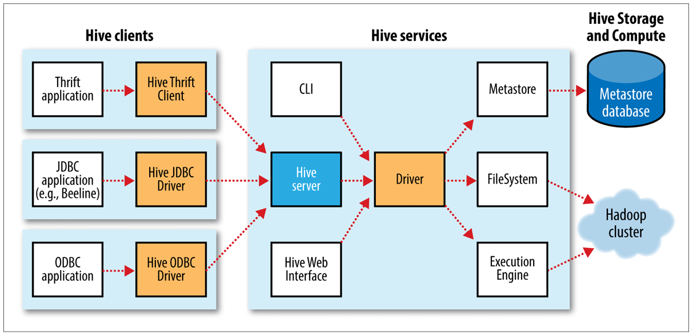
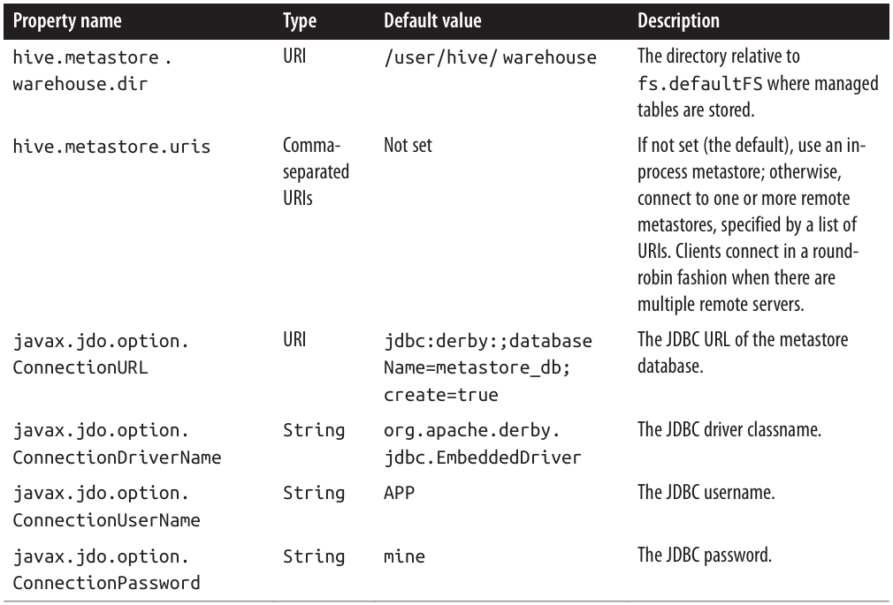

# Chapter 17. Hive

Apache Hive - A framework for data warehousing on top of Hadoop. Hive was created to make it possible for analysts with strong SQL skills to run queries on the huge volumes of data that Facebooj stored in HDFS.

## The Hive Shell

The shell is the primary way that we will interact with Hive, by issuing commands in HiveQL

    hive> SHOW TABLES;

> Like SQL, HiveQL is generally case insensitive

Run script in hive

    % hive -f script.q
    % hive -e 'SELECT * FROM dummy'
    % hive -S -e 'SELECT * FROM dummy' --show only result for queries

## An Example

First step - Load the data into Hive's managed storage. Here we'll have Hive use the local filesystem for storage; later we'll see how to store tables in HDFS

    CREATE TABLE records (year STRING, temperature INT, quality INT)
    ROW FORMAT DELIMITED
        FIELDS TERMINATED BY '\t';

Next - Populate Hive with the data

    LOAD DATA LOCAL INPATH 'input/ncdc/micro-tab/sample.txt'
    OVERWRITE INTO TABLE records;

Running this command tells Hive to put the specified local file in its warehouse directory. Tables are stored as directories under Hive's warehouse directory, default: `/user/hive/warehouse`

    % ls /user/hive/warehouse/records/
    sample.txt

The OVERWRITE keyword in the LOAD DATA statement tells Hive to delete any existing files in the directory for the table

Run query against it

    hive> SELECT year, MAX(temperature)
        > FROM records
        > WHERE temperature != 9999 AND quality IN (0, 1, 4, 5, 9)
        > GROUP BY year;

## Running Hive

### Configuring 

Override the configuration directory that Hive looks for in `hive-site.xml`

    % hive --config /Users/tom/dev/hive-conf

To see the current value of any property, use SET with just the property name:
    
    hive> SET hive.enforce.bucketing=true

    hive> SET hive.enforce.bucketing;
    hive.enforce.bucketing=true

    CREATE TABLE my_table (
    id INT,
    name STRING
    )
    CLUSTERED BY (id) INTO 4 BUCKETS;

### Execution engines

Hive was originally written to use MapReduce as its execution engine, and that is still the default. It is now also possible to run Hive using Apache Tez as its execution engine, and work is underway to support Spark

    hive> SET hive.execution.engine=tez;

## Hive Services

| Service       | Explain |
|---------------|---------|
| `cli`         | The command-line interface to Hive (the shell). This is the default service. |
| `hiveserver2` | Applications using  the Thrift, JDBC, and ODBC connectors need to run a Hive server to communicate with Hive (Set `hive.server2.thrift.port` defaults to 10000) |
| `beeline`     | A command-line interface to Hive that works like regular CLI, or by connecting to a HiveServer 2 process using JDBC |
| `hwi`         | The Hive Web Interface |
| `jar`         | The Hive equivalent of hadoop `jar`, a convenient way to run Java applications that includes both Hadoop and Hive classes on the classpath |
| `metastore`   | By default, the metastore is run in the same process as the Hive service. Using this  service, it is possible to run the metastore as a standalone (remote) process. Set the  METASTORE_PORT environment variable (or use the -p command-line option) to specify the port the server will listen on (defaults to 9083). |

## The Metastore

## Comparison with Traditional Databases

### Schema on Read Versus Schema on Write

In a traditional database, a table’s schema is enforced at data load time. If the data being  loaded doesn’t conform to the schema, then it is rejected. This design is sometimes called _schema on write_ because the data is checked against the schema when it is written into the database

Hive, on the other hand, doesn’t verify the data when it is loaded, but rather when a query is issued. This is called _schema on read_.

> Schema on read makes for a very fast initial load, since the data does not have to be read, parsed, and serialized to disk in the database’s internal format.

Schema on write makes query time performance faster because the database can index columns and perform compression on the data. The trade-off, however, is that it takes longer to load data into the database. Furthermore, there are many scenarios where the schema is not known at load time, so there are no indexes to apply, because the queries have not been formulated yet. These scenarios are where Hive shines.

### Updates, Transactions, and Indexes
