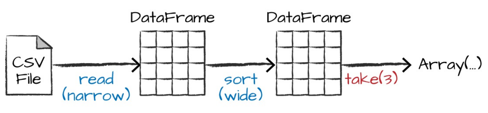

# Chapter 2. A Gentle Introduction to Spark

## Spark's Basic Architecture

Single machines do not have enough power and resources to perform computations on huge amounts of information (or the
user probably does not have the time to wait for the computation to finish). A cluster, or group, of computers, pools
the resources of many machines together, giving us the ability to use all the cumulative resources as if they were a
single computer. Spark manages and coordinates the execution of tasks on data across a cluster of computers.

### Spark Applications

Spark Applications consist of a _driver_ process and a set of _executor_ processes.

The _driver_ process runs your `main()` function, sits on a node in the cluster:

- Maintaining information about Spark Application

- Responding to a user's program or input

- Analyzing, distributing, and scheduling work across the executors

> Driver process maintains all relevant information during the lifetime of the application

The _executors_ carry out the work that the driver assigns them:

- Executing code assigned to it by the driver

- Reporting the state of the computation on that executor back to the driver node

Spark, in addition to its cluster mode, also has a _local mode_. The driver and executors are simply processes, which
means that they can live on the same machine or different machines. In local mode, the driver and executors run (as
threads) on your individual computer instead of a cluster.

> Spark employs a cluster manager that keeps track of the resources available. The driver process is responsible for
> executing the driver program’s commands across the executors to complete a given task.

## The SparkSession

We created a _DataFrame_ with one column containing 1,000 rows with values from 0 to 999. This range of numbers
represents a _distributed collection_. When run on a cluster, each part of this range of numbers exists on a different
executor. This is a Spark DataFrame

## DataFrames

The most common Structured API and simply represents a table of data with rows and columns. The list that defines the
columns and the types within those columns is called the _schema_.

> Spark has several core abstractions: Datasets, DataFrames, SQL Tables, and Resilient Distributed Datasets (RDDs)

### Partitions

To allow every executor to perform work in parallel, Spark breaks up the data into chunks called _partitions_. A
partition is a collection of rows that sit on one physical machine in your cluster.

> With DataFrames you do not (for the most part) manipulate partitions manually or individually. You simply specify
> high-level transformations of data in the physical partitions, and Spark determines how this work will actually
> execute
> on the cluster.

## Transformations

In Spark, the core data structures are _immutable_, meaning they cannot be changed after they’re created. To “change” a
DataFrame, you need to instruct Spark how you would like to modify it to do what you want. These instructions are called
_transformations_.

    // in Scala
    val divisBy2 = myRange.where("number % 2 = 0")

    # in Python
    divisBy2 = myRange.where("number % 2 = 0")

There are two types of transformations:

- _narrow dependencies_ - for which each input partition will contribute to only one output partition

- _wide dependencies_ - input partitions contributing to many output partitions

> This referred to as a _shuffle_ whereby Spark will exchange partitions across the cluster

With narrow transformations, Spark will automatically perform an operation called `pipelining`, meaning that if we
specify multiple filters on DataFrames, they’ll all be performed in-memory. The same cannot be said for shuffles. When
we perform a shuffle, Spark writes the results to disk.

### Lazy Evaluation

Spark will wait until the very last moment to execute the graph of computation instructions. In Spark, instead of
modifying the data immediately when you express some operation, you build up a plan of transformations that you would
like to apply to your source data. By waiting until the last minute to execute the code, Spark compiles this plan from
your raw DataFrame transformations to a streamlined physical plan that will run as efficiently as possible across the
cluster. This provides immense benefits because Spark can optimize the entire data flow from end to end.

## Actions

Transformations allow us to build up our logical transformation plan. To trigger the computation, we run an _action_. An
action instructs Spark to compute a result from a series of transformations.

    divisBy2.count()

Three kinds of actions:

- Actions to view data in the console

- Actions to collect data to native object in the respective language

- Actions to write to output data sources

## Spark UI

You can monitor the progress of a job through the Spark web UI. The Spark UI is available on port 4040 of the driver
node. If you are running in local mode, this will be http://localhost:4040.

## An End-to-End Example

Spark includes the ability to read and write from a large number of data sources. To read this data, we will use a
DataFrameReader that is associated with our SparkSession. In our case, we want to do something called schema inference,
which means that we want Spark to take best guess at what the schema of our DataFrame should be. We also want to
specify that the first row is the header in the file, so we’ll specify that as an option, too.

    // in Scala
    val flightData2015 = spark
        .read
        .option("inferSchema", "true")  // guess schema
        .option("header", "true")  // first line is header
        .csv("/data/flight-data/csv/2015-summary.csv")

    # in Python
    flightData2015 = spark\
    .read\
    .option("inferSchema", "true")\
    .option("header", "true")\
    .csv("/data/flight-data/csv/2015-summary.csv")

Each of these DataFrames (in Scala and Python) have a set of columns with an unspecified number of rows. The reason the
number of rows is unspecified is that reading data is a transformation, and is therefore a lazy operation. Spark peeked
at only a couple of rows of data to try to guess what types each column should be.

    flightData2015.take(3)

    Array([United States,Romania,15], [United States,Croatia...

We can call explain on any DataFrame object to see the DataFrame’s lineage (or how Spark will execute this query)

    flightData2015.sort("count").explain()

    == Physical Plan ==
    *Sort [count#195 ASC NULLS FIRST], true, 0
    +- Exchange rangepartitioning(count#195 ASC NULLS FIRST, 200)
        +- *FileScan csv [DEST_COUNTRY_NAME#193,ORIGIN_COUNTRY_NAME#194,count#195] ...

You can read explain plans from top to bottom, the top being the end result, and the bottom being the source(s) of data

### DataFrames and SQL

With Spark SQL, you can register any DataFrame as a table or view (a temporary table) and query it using pure SQL. You
can make any DataFrame into a table or view with one simple method call:

    flightData2015.createOrReplaceTempView("flight_data_2015")

We can query our data in SQL using `spark.sql` (`spark` is our SparkSession variable) that conveniently returns a new
DataFrame.

    // in Scala
    val sqlWay = spark.sql(
    """
    SELECT DEST_COUNTRY_NAME, count(1)
    FROM flight_data_2015
    GROUP BY DEST_COUNTRY_NAME
    """
    )

    val dataFrameWay = flightData2015
        .groupBy('DEST_COUNTRY_NAME)
        .count()

    sqlWay.explain
    dataFrameWay.explain

    // result
    == Physical Plan ==
    *HashAggregate(keys=[DEST_COUNTRY_NAME#182], functions=[count(1)])
    +- Exchange hashpartitioning(DEST_COUNTRY_NAME#182, 5)
        +- *HashAggregate(keys=[DEST_COUNTRY_NAME#182], functions=[partial_count(1)])
            +- *FileScan csv [DEST_COUNTRY_NAME#182] ...

We will use the max function, to establish the maximum number of flights to and from any given location

    spark.sql("SELECT max(count) from flight_data_2015").take(1)

    // in Scala
    import org.apache.spark.sql.functions.max
    flightData2015.select(max("count")).take(1)

    # in Python
    from pyspark.sql.functions import max

    flightData2015.select(max("count")).take(1)

A bit more complicated:

    // in Scala
    val maxSql = spark.sql("""
    SELECT DEST_COUNTRY_NAME, sum(count) as destination_total
    FROM flight_data_2015
    GROUP BY DEST_COUNTRY_NAME
    ORDER BY sum(count) DESC
    LIMIT 5
    """)

    maxSql.show()

    // in Scala
    import org.apache.spark.sql.functions.desc

    flightData2015
    .groupBy("DEST_COUNTRY_NAME")
    .sum("count")
    .withColumnRenamed("sum(count)", "destination_total")
    .sort(desc("destination_total"))
    .limit(5)
    .show()

