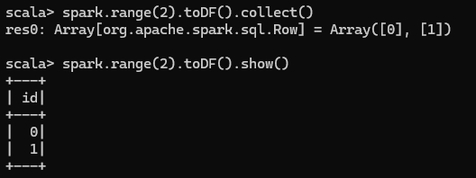

# Chapter 4. Structured API Overview

The Structured APIs are a tool for manipulating all sorts of data, from unstructured log files to semi-structured CSV
files and highly structured Parquet files. Three core types of distributed collection APIs:

- Datasets
- DataFrames
- SQL tables and views

The Structured APIs are the fundamental abstraction that you will use to write the majority of your data flows. In this
chapter, we'll introduce the fundamental concepts: the typed and untyped APIs (and their differences); how Spark
actually takes your Structured API data flows and execute it on the cluster.

## DataFrames and Datasets

Spark has two notions of structured collections: DataFrames and Datasets

DataFrames and Datasets are (distributed) table-like collections with well-defined rows and columns. Each column must
have the same number of rows as all the other columns (although you can use null to specify the absence of a value) and
each column has type information that must be consistent for every row in the collection.

DataFrames and Datasets represent immutable, lazily evaluated plans that specify what operations to apply to data
residing at a location to generate some output. When we perform an action on a DataFrame, we instruct Spark to perform
the actual transformations and return result.

## Schemas

A schema defines the column names and types os a DataFrame. You can define schemas manually or read a schema from a data
source (_schema on read_). Schemas consist of types.

## Overview of Structured Spark Types

Internally, Spark uses an engine called _Catalyst_ that maintains its own type information through the planning and
processing of work. Even if we use Spark’s Structured APIs from Python or R, the majority of our manipulations will
operate strictly on _Spark types_, not Python types

The following code does not perform addition in Scala or Python; it actually performs addition _purely in Spark_:

    // in Scala
    val df = spark.range(500).toDF("number")
    df.select(df.col("number") + 10)

    # in Python
    df = spark.range(500).toDF("number")
    df.select(df["number"] + 10)

Spark will convert an expression written in an input language to Spark’s internal Catalyst representation of that same
type information.

### DataFrames Versus Datasets

Within the Structured APIS, there are two more APIs, the "untyped" DataFrames and the "typed" Datasets.

DataFrames have types, but Spark maintain them completely and only checks whether those types line up to those specified
in the schema at _runtime_. Datasets, on the other hand, check whether types conform to the specification at _compile
time_.

### Columns

Columns represent a simple type like an integer or string, a complex type like an array or map, or a null value. Spark
tracks all of this type information for you and offers a variety of ways, with which you can transform columns

### Rows

A row is nothing more than a record of data. Each record in a DataFrame must be of type `Row`, as we can see when we
collect the following DataFrames. We can create these rows manually from SQL, from Resilient Distributed Datasets (
RDDs), from data sources, or manually from scratch

    // in Scala
    spark.range(2).toDF().collect()
    # in Python
    spark.range(2).collect()

Result in an array of `Row` object

### Spark Types

How we instantiate, or declare, a column to be of a certain type:

- Work with correct Scala types:

      import org.apache.spark.sql.types._
      val b = ByteType()

- Work with correct Java types:

      import org.apache.spark.sql.types.DataTypes
      ByteType x = DataTypes.ByteType;

- Work with correct Python types:

      from pyspark.sql.types import *
      b = ByteType()

https://spark.apache.org/docs/latest/sql-ref-datatypes.html

## Overview of Structured API Execution

The execution of a single structured API query from user code to executed code:

- Write DataFrame/Dataset/SQL Code
- If valid code, Spark convert this to a _Logical Plan_
- Spark transform this _Logical Plan_ to a _Physical Plan_, checking for optimization along the way
- Spark then executes this _Physical Plan_ (RDD manipulations) on the cluster

### Logical Planning

### Physical Planning

### Execution

Upon selecting a physical plan, Spark runs all of this code over RDDs, the lower-level programming interface of Spark.
Spark performs further optimizations at runtime, generating native Java bytecode that can remove entire tasks or stages
during execution. Finally, the result is returned to the user.
