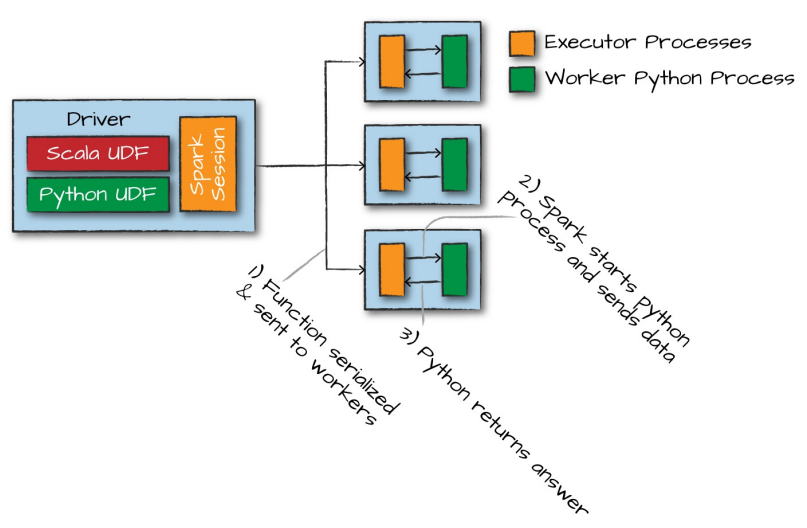

# Chapter 6. Working with Different Types of Data

## Where to Look for APIs

https://spark.apache.org/docs/latest/api/scala/index.html
https://spark.apache.org/docs/3.1.3/api/python/reference/index.html

    val df = spark.read.format("csv")
        .option("header", "true")
        .option("inferSchema", "true")
        .load("/data/retail-data/by-day/2010-12-01.csv")
    df.printSchema()
    df.createOrReplaceTempView("dfTable")

    root
    |-- InvoiceNo: string (nullable = true)
    |-- StockCode: string (nullable = true)
    |-- Description: string (nullable = true)
    |-- Quantity: integer (nullable = true)
    |-- InvoiceDate: timestamp (nullable = true)
    |-- UnitPrice: double (nullable = true)
    |-- CustomerID: double (nullable = true)
    |-- Country: string (nullable = true)

## Converting to Spark Types

Convert native types to Spark types using the `lit` function

    // in Scala
    import org.apache.spark.sql.functions.lit
    df.select(lit(5), lit("five"), lit(5.0))

## Working with Booleans

    import org.apache.spark.sql.functions.col
    df.where(col("InvoiceNo").equalTo(536365))  // or col("InvoiceNo") === 536365
      .select("InvoiceNo", "Description")
      .show(5, false)

Cleanest

    df.where("InvoiceNo = 536365")
      .show(5, false)  // truncate = false

    df.where("InvoiceNo <> 536365")
      .show(5, false)

Specify Boolean expressions with multiple parts: chain together and filters as a sequential filter

> Spark will flatten all of these filters into one statement and perform the filter at the same time, create the `and`
> statement for us. `or` statements need to be specified in the same statement.

    // in Scala
    val priceFilter = col("UnitPrice") > 600
    val descripFilter = col("Description").contains("POSTAGE") // conditions
    df.where(col("StockCode").isin("DOT"))
      .where(priceFilter.or(descripFilter))
      .show()

isin: https://spark.apache.org/docs/3.1.3/api/python/reference/api/pyspark.sql.Column.isin.html

    # in Python
    from pyspark.sql.functions import instr
    priceFilter = col("UnitPrice") > 600
    descripFilter = instr(df.Description, "POSTAGE") >= 1
    df.where(df.StockCode.isin("DOT")).where(priceFilter | descripFilter).show()

instr: https://spark.apache.org/docs/3.1.3/api/python/reference/api/pyspark.sql.functions.instr.html?highlight=instr#pyspark.sql.functions.instr

To filter a `DataFrame`, you can also just specify a Boolean column

    // in Scala
    val DOTCodeFilter = col("StockCode") === "DOT"
    val priceFilter = col("UnitPrice") > 600
    val descripFilter = col("Description").contains("POSTAGE")
    df.withColumn("isExpensive", DOTCodeFilter.and(priceFilter.or(descripFilter)))
      .where("isExpensive")
      .select("unitPrice", "isExpensive").show(5)

    # in Python
    from pyspark.sql.functions import instr    

    DOTCodeFilter = col("StockCode") == "DOT"
    priceFilter = col("UnitPrice") > 600
    descripFilter = instr(col("Description"), "POSTAGE")
    df.withColumn("isExpensive", DOTCodeFilter & (priceFilter | descripFilter))
      .where("isExpensive")
      .select("unitPrice", "isExpensive").show(5)

It's often easier to just express filter as SQL statements than using the programmatic `DataFrame` interface

    df.withColumn("isExpensive", not(col("UnitPrice").leq(250)))

    df.withColumn("isExpensive", expr("NOT UnitPrice <= 250"))

Null-safe equivalent test (pyspark)

    df.where(col("Description").eqNullSafe("hello")).show()

eqNullSafe: https://youtu.be/-qx6bF-T6dw

## Working with Numbers

`pow` function

    import org.apache.spark.sql.functions.{expr, pow}
    val fabricatedQuantity = pow(col("Quantity") * col("UnitPrice"), 2) + 5
    df.select(expr("CustomerId"), fabricatedQuantity.alias("realQuantity"))
      .show()
    // fabricatedQuantity is an expression so CustomerId needs to be expression too

We can do all of this as a SQL expression

    df.selectExpr(
        "CustomerId",
        "(POWER((Quantity * UnitPrice), 2.0) + 5) as realQuantity"
    ).show(2)

Rounding

    // in Scala
    import org.apache.spark.sql.functions.{round, bround}
    df.select(round(col("UnitPrice"), 1).alias("rounded"), col("unitPrice").show(5)
    // bround round down

Compute the correlation of two columns. For example, we can see the Pearson correlation coefficient for two columns to
see if cheaper things are typically bought in greater quantities

    df.stat.corr("Quantity", "UnitPrice")
    df.select(corr("Quantity", "UnitPrice")).show()

`describe` method computes summary statistics for a column or set of column

    df.describe().show()

    +-------+------------------+------------------+------------------+
    |summary|          Quantity|         UnitPrice|        CustomerID|
    +-------+------------------+------------------+------------------+
    |  count|              3108|              3108|              1968|
    |   mean| 8.627413127413128| 4.151946589446603|15661.388719512195|
    | stddev|26.371821677029203|15.638659854603892|1854.4496996893627|
    |    min|               -24|               0.0|           12431.0|
    |    max|               600|            607.49|           18229.0|
    +-------+------------------+------------------+------------------+

    import org.apache.spark.sql.functions.{count, mean, stddev_pop, min, max}

There are a number of statistical functions available in the StatFunction Package (accessible using `stat`)

Calculate approximate quantiles of data

    val colName = "UnitPrice"
    val quantileProbs = Array(0.5)
    val relError = 0.05
    df.stat.approxQuantile("UnitPrice", quantileProbs, relError)

Cross-tabulation

    // in Scala
    df.stat.crosstab("StockCode", "Quantity").show()

    # in Python
    df.stat.crosstab("StockCode", "Quantity").show()

Frequent item pairs

    // in Scala
    df.stat.freqItems(Seq("StockCode", "Quantity")).show()

    # in Python
    df.stat.freqItems(["StockCode", "Quantity"]).show()

Add unique ID to each row by using `monotonically_increasing_id` function

    // in Scala
    import org.apache.spark.sql.functions.monotonically_increasing_id
    df.select(monotonically_increasing_id()).show(2)

    # in Python
    from pyspark.sql.functions import monotonically_increasing_id
    df.select(monotonically_increasing_id()).show(2)

## Working with Strings

The `initcap` function: Capitalize every word in a given string when that word is separated from another by a space

    df.select(initcap(col("Description"))).show()

Cast strings in uppercase and lowercase

    df.select(
        col("Description"),
        lower(col("Description"),
        upper(col("Description")
    ).show()

Adding or removing spaces around a string: `lpad`, `ltrim`, `rpad`, `rtrim`, `trim`

### Regular Expressions

Regular expressions give the user an ability to specify a set of rules to use to either extract values from a string or
replace them with some other values

Two key functions in Spark: `regexp_extract` and `regexp_replace`

    // scala
    import org.apache.spark.sql.functions.regexp_replace
    val simpleColors = Seq("black", "white", "red", "green", "blue")
    val regexString = simpleColors.map(_.toUpperCase).mkString("|")
    df.select(
        regexp_replace(col("Description"), regexString, "COLOR").alias("color_clean"),
        col("Description")
    ).show(2)

    // python
    from pyspark.sql.functions import regexp_place
    regex_string = "BLACK|WHITE|RED|GREEN|BLUE"
    df.select(
        regexp_replace(col("Description"), regex_string, "COLOR").alias("color_clean")
        col("Description")
    ).show(2)

    +--------------------+--------------------+
    |         color_clean|         Description|
    +--------------------+--------------------+
    |COLOR HANGING HEA...|WHITE HANGING HEA...|
    | COLOR METAL LANTERN| WHITE METAL LANTERN|
    +--------------------+--------------------+
    // Replace WHITE with COLOR

Replace given characters with other characters

    df.select(translate(col("Description"), "LEET", "1337"), col("Description")).show(2)

    +----------------------------------+--------------------+
    |translate(Description, LEET, 1337)|         Description|
    +----------------------------------+--------------------+
    |              WHI73 HANGING H3A...|WHITE HANGING HEA...|
    |               WHI73 M37A1 1AN73RN| WHITE METAL LANTERN|
    +----------------------------------+--------------------+

Using regexp_extract

    val regexString = simpleColors.map(_.toUpperCase).mkString("(", "|", ")") // python: regexString = "(BLACK|WHITE|RED|GREEN|BLUE)"
    df.select(
        regexp_extract(col("Description"), regexString, 1).alias("color_clean"),
        col("Description")
    ).show(2)

Check for existence

    col("Description").contains("BLACK")

## Working with Dates and Timestamps

Get the current date and the current timestamp

    .withColumn("today", current_date())
    .withColumn("now", current_timestamp())

Add and subtract days

    dateDF.select(date_sub(col("today"), 5), date_add(col("today"), 5)).show()

The `datediff` function that returns the number of days in between two dates

    select(datediff(col("week_ago"), col("today"))

The `months_between` gives the number of month between two dates

    select(months_between(col("start"), col("end"))).show()

The `to_date` function converts a string to a date, optionally with a specified format

    spark.range(5).withColumn("date", lit("2017-01-01"))
        .select(to_date(col("date"))).show(1)

> If cannot parse the date, it returns `null`

    dateDF.select(to_date(lit("2016-20-12")),to_date(lit("2017-12-11"))).show(1)

    +-------------------+-------------------+
    |to_date(2016-20-12)|to_date(2017-12-11)|
    +-------------------+-------------------+
    |               null|         2017-12-11|
    +-------------------+-------------------+

Date format according to: https://docs.oracle.com/javase/8/docs/api/java/text/SimpleDateFormat.html

    val dateFormat = "yyyy-dd-MM"
    spark.range(1).select(
        to_date(lit("2017-12-11"), dateFormat).alias("date"),
        to_date(lit("2017-20-12"), dateFormat).alias("date2")
    ).show()

`to_timestamp` always requires a format to be specified

    select(to_timestamp(col("date"), dateFormat))

    +----------------------------------+
    |to_timestamp(`date`, 'yyyy-dd-MM')|
    +----------------------------------+
    |               2017-11-12 00:00:00|
    +----------------------------------+

## Working with Nulls in Data

There are two things you can do with null values: drop nulls or fill them with a value (globally or on a per-column
basis)

### Coalesce

Spark includes a function to allow you to select the first non-null value from a set of columns by using the `coalesce`
function

    df.select(coalesce(col("Description"), col("CustomerId"))).show()

### ifnull, nullif, nvl, and nvl2

- `ifnull` - select the second value if thr first is null, and defaults to the first
- `nullif` - returns null if the two values are equal or else returns the second if they are not
- `nvl` - returns the second value if the first is null, defaults to the first
- `nvl2` - returns the second value if the first is not null; otherwise, return the last specified value (example)

        SELECT
            ifnull(null, 'return_value') // return_value
            nullif('value', 'value') // null
            nvl(null, 'return_value') // return_value
            nvl2('not_null', 'return_value', 'else_value')
        FROM dfTable LIMIT 1;

### drop

Removes rows that contain nulls. The default is to drop any row in which any value is null

    df.na.drop()
    df.na.drop("any")

Using "all" drops the row only if all values are `null` or `NaN` for that row

    df.na.drop("all")

We can also apply this to certain sets of columns by passing in an array of columns

    // in Scala
    df.na.drop("all", Seq("StockCode", "InvoiceNo"))

    # in Python
    df.na.drop("all", subset=["StockCode", "InvoiceNo"])

### fill

Fill all `null` values in columns of type String

    df.na.fill("All Null values become this string")

We could do the same for columns of different type

    df.na.fill(5:Integer)
    df.na.fill(5:Double)

To specify columns

    // in Scala
    df.na.fill(5, Seq("StockCode", "InvoiceNo"))

    # in Python
    df.na.fill("all", subset=["StockCode", "InvoiceNo"])

We can also do this with a Scala `Map`, where the key is the column name and the value is the value we would like to use
to fill null values

    // in Scala
    val fillColValues = Map("StockCode" -> 5, "Description" -> "No Value")
    df.na.fill(fillColValues)

    # in Python
    fill_col_vals = {"StockCode": 5, "Description" : "No Value")
    df.na.fill(fill_col_vals)

### replace

Replace all values in a certain column according to their current value. The only requirement is that this value be the
same type as the original values

    // in Scala
    df.na.replace("Description", Map("" -> "UNKNOWN"))
    
    # in Python
    df.na.replace([""], ["UNKNOWN"], "Description")

## Ordering

You can use `asc_nulls_first`, `desc_nulls_first`, `asc_nulls_last`, `desc_nulls_last`

## Working with Complex Types

### Structs

Create struct by wrapping a set of columns in parentheses in a query

    df.selectExpr("(Description, InvoiceNo) as complex", "*")
    df.selectExpr("struct(Description, InvoiceNo) as complex", "*")

    val complexDF = df.select(struct("Description", "InvoiceNo").alias("complex")
    // DataFrame with a column `complex`

Use dot syntax to query, or the column method `getField`

    complexDF.select("complex.Description")
    complexDF.select(col("complex").getField("Description"))

Query all

    comlexDF.select("complex.*")

### Arrays

Objective: Take every single word in our `Description` column and convert that into a row in our DataFrame. The first
task is to turn our `Description` column into a complex type, an array

### split

Using the `split` function and specify the delimiter

    df.select(split(col("Description"), " ")).show(2)

    +---------------------+
    | split(Description, )|
    +---------------------+
    | [WHITE, HANGING, ...|
    | [WHITE, METAL, LA...|
    +---------------------+

Spark allows us to manipulate this complex type as another column

    df.select(split(col("Description"), " ").alias("array_col")
      .selectExpr("array_col[0]").show(2)

    +------------+
    |array_col[0]|
    +------------+
    |       WHITE|
    |       WHITE|
    +------------+

### Array Length

    df.select(size(split(col("Description"), " "))).show(2)

### array_contains

See whether this array contains a value

    df.select(array_contains(split(col("Description"), " "), "WHITE")).show(2) // true or false each row

### explode

The `explode` function takes a column that consists of arrays and creates one row (with the rest of the values
duplicated) per value in the array

    df.withColumn("splitted", split(col("Description"), " "))
      .withColumn("exploded", explode(col("splitted")))
      .select("Description", "InvoiceNo", "explode").show(2)

    +--------------------+---------+--------+
    |         Description|InvoiceNo|exploded|
    +--------------------+---------+--------+
    |WHITE HANGING HEA...|   536365|   WHITE|
    |WHITE HANGING HEA...|   536365| HANGING|
    +--------------------+---------+--------+

### Maps

Maps are created by using the `map` function and key-value pairs of columns

    df.select(map(col("Description"), col("InvoiceNo")).alias("complex_map")).show(2)

    +--------------------+
    |         complex_map|
    +--------------------+
    |Map(WHITE HANGING...|
    |Map(WHITE METAL L...|
    +--------------------+

You can query them by using the proper key. A missing key returns `null`

    df.select(map(col("Description"), col("InvoiceNo")).alias("complex_map"))
      .selectExpr("complex_map['WHITE METAL LANTERN']").show(2)

    +--------------------------------+
    |complex_map[WHITE METAL LANTERN]|
    +--------------------------------+
    |                            null|
    |                          536365|
    +--------------------------------+

Explode `map` types will return them into columns

    df.select(map(col("Description"), col("InvoiceNo")).alias("complex_map"))
      .selectExpr("explode(complex_map)").show(2)

    +--------------------+------+
    |                 key| value|
    +--------------------+------+
    |WHITE HANGING HEA...|536365|
    | WHITE METAL LANTERN|536365|
    +--------------------+------+

## Working with JSON

You can operate directly on strings of JSON in Spark and parse from JSON or extract JSON objects

    val jsonDF = spark.range(1).selectExpr(
      """
      '{"myJSONKey" : {"myJSONValue" : [1, 2, 3]}}' as jsonString
      """
    }

The `get_json_object` to inline query a JSON object, be it a dictionary or array. You can use `json_tuple` if this
object has only one level of nesting

    import org.apache.spark.sql.functions.{get_json_object, json_tuple}
    jsonDF.select(
      get_json_object(col("jsonString"), "$.myJSONKey.myJSONValue[1]") as "column",
      json_tuple(col("jsonString"), "myJSONKey")
    ).show(2)

Turn a StructType into a JSON string by using the `to_json` function

    import org.apache.spark.sql.functions.to_json
    df.selectExpr("(InvoiceNo, Description) as myStruct")
      .select(to_json(col("myStruct")))

This function also accepts a dictionary (map) of parameters that are the same as the JSON data source. You can use the
`from_json` function to parse this (or other JSON data) back in. This naturally requires you to specify a schema, and
optionally you can specify a map of options

    // in Scala
    import org.apache.spark.sql.functions.from_json
    import org.apache.spark.sql.types._
    val parseSchema = new StructType(Array(
      new StructField("InvoiceNo",StringType,true),
      new StructField("Description",StringType,true)))
    df.selectExpr("(InvoiceNo, Description) as myStruct")
      .select(to_json(col("myStruct")).alias("newJSON"))
      .select(from_json(col("newJSON"), parseSchema), col("newJSON")).show(2)

    # in Python
    from pyspark.sql.functions import from_json
    from pyspark.sql.types import *
    parseSchema = StructType((
      StructField("InvoiceNo",StringType(),True),
      StructField("Description",StringType(),True)))
    df.selectExpr("(InvoiceNo, Description) as myStruct")\
      .select(to_json(col("myStruct")).alias("newJSON"))\
      .select(from_json(col("newJSON"), parseSchema), col("newJSON")).show(2)

## User-Defined Functions (UDFs)

These user-defined functions (UDFs) make it possible for you to write your own custom transformations using Python or
Scala and even use external libraries

Example

    val udfExampleDF = spark.range(5).toDF("num")
    def power3(number:Double):Double = number * number * number
    power3(2.0)

Now that we’ve created these functions and tested them, we need to register them with Spark so that we can use them on
all of our worker machines. Spark will serialize the function on the driver and transfer it over the network to all
executor processes. This happens regardless of language.

If the function is written in Scala or Java, you can use it within the Java Virtual Machine (JVM). This means that there
will be little performance penalty aside from the fact that you can’t take advantage of code generation capabilities
that Spark has for built-in functions

If the function is written in Python, something quite different happens. Spark starts a Python process on the worker,
serializes all the data to a format that Python can understand (remember, it was in the JVM earlier), executes the
function row by row on that data in the Python process, and then finally returns the results of the row operations to
the JVM and Spark

> Starting this Python process is expensive, but the real cost is in serializing the data to Python. Recommended write
> your UDFs in Scala or Java

First, register the function to make it available as a DataFrame function

    import org.apache.spark.sql.functions.udf
    val power3udf = udf(power3(_:Double):Double)

With Python

    def power3(double_value):
      return double_value ** 3

    from pyspark.sql.functions import udf
    power3udf = udf(power3)

We can use that just like any other DataFrame function

    udfExampleDF.select(power3udf(col("num"))).show(truncate=false)

We can also register this UDF as a Spark SQL function (for using string expression)

    spark.udf.register("power3", power3(_:Double):Double)
    udfExampleDF.selectExpr("power3(num)").show(2)

One thing we can also do to ensure that our functions are working correctly is specifying a return type (best practice
for Python)

    from pyspark.sql.types import IntegerType, DoubleType
    spark.udf.register("power3py", power3, DoubleType())

If you specify the type that doesn’t align with the actual type returned by the function, Spark will not throw an error
but will just return null to designate a failure