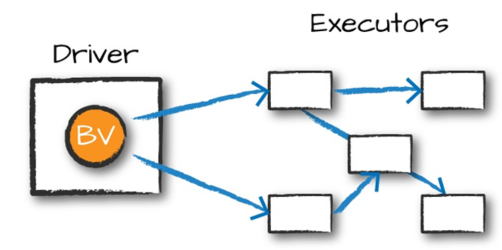
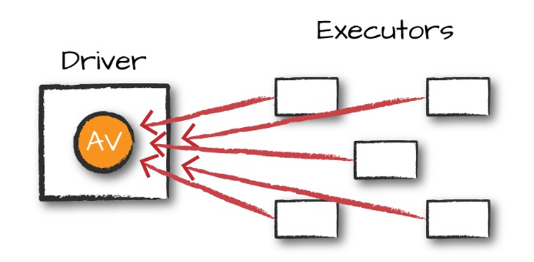
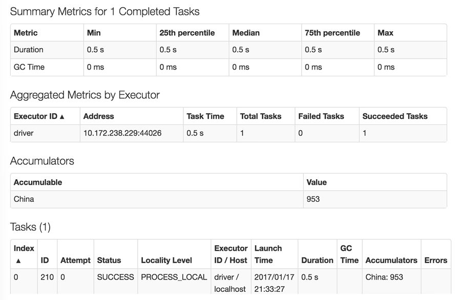

# Chapter 14. Distributed Shared Variables

The second kind of low-level API in Spark is two types of "distributed shared variables"

- Broadcast variables
- Accumulators

Specificially, _accumulators_ let you add together data from all tasks into a shared result (e.g, to implement a counter so you can see how many of your job's input records failed to parse), while _broadcast_ variables let you save a large value on all the worker nodes and reuse it across many Spark actions without re-sending it to the cluster

## Broadcast Variables

The normal way to use a variable in your driver node inside your tasks is to simply reference it in your function closures, but this can be inefficient, especially for large variables such as lookup table or a machine learning model.

Broadcast variables are shared, immutable variables that are cached on every machine in the cluster instead of serialized with every single task.

For example

    # A list of words
    my_collection = "Spark The Definitive Guide: Big Data Processing Made Simple" \
        .split(" ")
    words = spark.sparkContext.parallelize(my_collection, 2)

    # Supplemental data defined in driver
    supplemental_data = {
        "Spark": 1000,
        "Definitive", 200, 
        "Big": -300,
        "Simple": 100
    }

    # Broadcast supplemental data to executors
    supp_broadcast = spark.sparkContext.broadcast(supplemental_data)
    supp_broadcast.value  # access without having to serialize the data

    words.map(lambda word: (word, supp_broadcast.value.get(word, 0))) \
        .sortBy(lambda wordPair: wordPair[1]) \
        .collect()

The only different between this and passing it into the closure is that we have done this in a much more efficient manner. Although this small dictionary probably is not too large of a cost, if you have a much larger value, the cost of serializing the data for every task can be quite significant.

## Accumulators

Accumulators are a way of updating a value inside of a variety of tranformations and propagating that value to the driver node in an efficient and fault-tolerant way

Accumulators provide a mutable variable that a Spark cluster can safely update on a per-row basis. You can use these for debugging purposes or to create low-level aggregation. Spark natively supports accumulators of numeric types, and programmers can add support for new types

Accumulators do not change the lazy evaluation model of Spark. If an accumulator is being updated within an operation on an RDD, its value is updated only once that RDD is actually computed. Consequently, accumulator updates are not guaranteed to be executed when made within a lazy transformation like map().

Accumulators can be both named and unnamed. Named accumulators will display their running results in the Spark UI, whereas unnamed ones will not.

### Basic Example

    flights = spark.read \
        .parquet("/data/flight-data/parquet/2010-summary.parquet")
    # Create accumulator variable
    acc_china = spark.sparkContext.accumulator(0)
    flights.foreach(lambda flight_row: acc_china_func(flight_row))

    # define lambda function
    def acc_china_func(flight_row):
        destination = flight_row["DEST_COUNTRY_NAME"]
        origin = fight_row["ORIGIN_COUNTRY_NAME"]
        if destination == "china" or origin == "china":
            acc_china.add(fight_row["count"])  #  add count to accumulator variable

### Custom Accumulators

    // in Scala
    import scala.collection.mutable.ArrayBuffer
    import org.apache.spark.util.AccumulatorV2

    val arr = ArrayBuffer[BigInt]()
    
    class EvenAccumulator extends AccumulatorV2[BigInt, BigInt] {
        private var num:BigInt = 0
    
        def reset(): Unit = {
            this.num = 0
        }
    
        def add(intValue: BigInt): Unit = {
            if (intValue % 2 == 0) {
                this.num += intValue
            }
        }
        
        def merge(other: AccumulatorV2[BigInt,BigInt]): Unit = {
            this.num += other.value
        }
    
        def value():BigInt = {
            this.num
        }

        def copy(): AccumulatorV2[BigInt,BigInt] = {
            new EvenAccumulator
        }

        def isZero():Boolean = {
            this.num == 0
        }
    }

    val acc = new EvenAccumulator
    val newAcc = sc.register(acc, "evenAcc")
    // in Scala
    acc.value // 0
    flights.foreach(flight_row => acc.add(flight_row.count))
    acc.value // 31390
