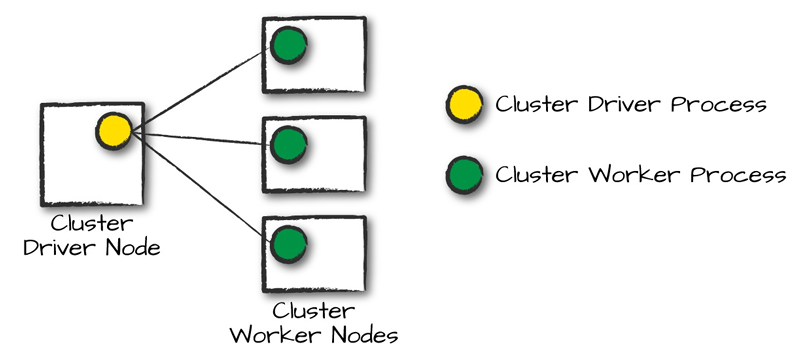
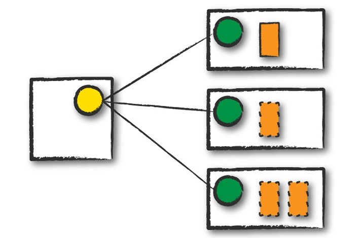
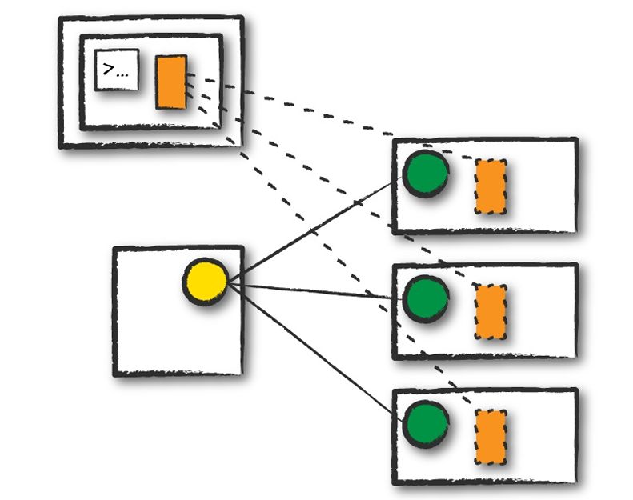
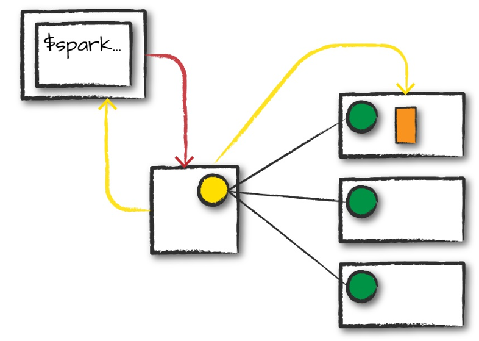
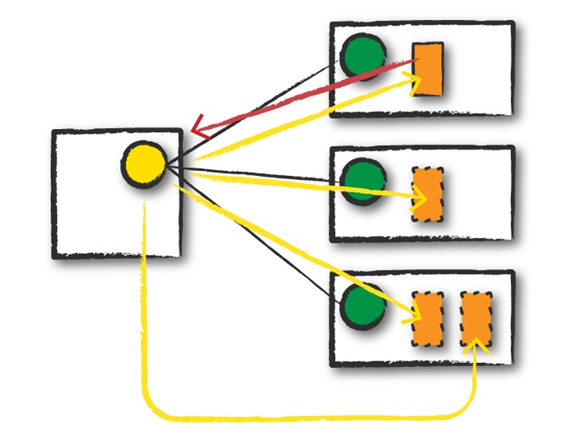
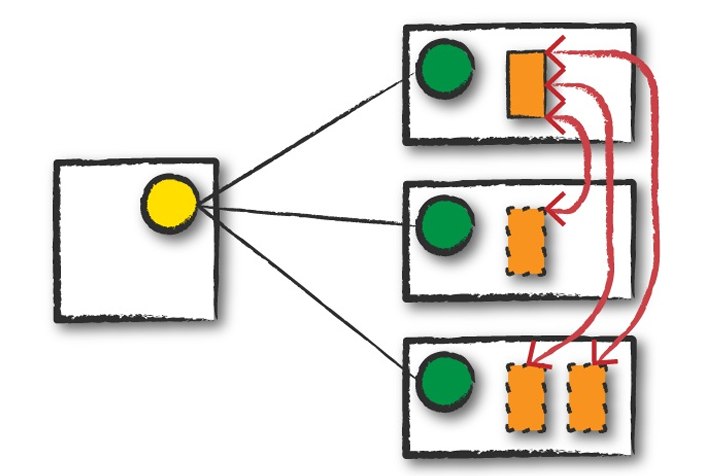

# Chapter 15. How Spark Runs on a Cluster

Topics covered

-  The architecture and components of a Spark Application
- The life cycle of a Spark Application inside and outside of Spark
- Important low-level execution properties, such as pipelining
- What it takes to run a Spark Application

## The Architecture of a Spark Application

Review high-level components of a Spark Application:

- The Spark driver - the controller of the execution of a Spark Application and maintains all of the state of the Spark cluster. It must interface with the cluster manager in order to actually get physical resources and launch executors. At the end of the day, this is just a process on a physical machine that is responsible for maintaining the state of the application running on the cluster.

- The Spark executors - the processes that perform the tasks assigned by the Spark driver: take the tasks assigned by the driver, run them, and report back their state (success or failure) and results.

- The cluster manager - responsible for maintaining a cluster of machines that will run your Spark Application(s). Somewhat confusingly, a cluster manager will have its own  “driver” (sometimes called master) and “worker” abstractions. The core difference is that these are tied to physical machines rather than processes (as they are in Spark)

When it comes time to actually run a Spark Application, we request resources from the cluster  manager to run it. Depending on how our application is configured, this can include a place to run the Spark driver or might be just resources for the executors for our Spark Application.

Spark currently supports three cluster managers

- Built-in stadalone cluster manager
- Apache Mesos
- Hadoop YARN0

### Execution Modes

An execution _mode_ gives you the power to determine where the aforementioned resources are physically located when you go to run your application. You have three modes to choose: cluster mode, client mode, local mode

#### Cluster mode - most common way

In cluster mode, a user submits a pre-compiled JAR, Python script, or R script to a cluster manager. The cluster manager then launches the driver process on a worker node inside the cluster, in addition to the executor processes. This means that the cluster manager is responsible for maintaining all Spark Application–related processes

(outlined orange box - driver process)

#### Client mode

Client mode is nearly the same as cluster mode except that the Spark driver remains on the client machine that submitted the application. This means that the client machine is responsible for maintaining the Spark driver process, and the cluster manager maintains the executor processses.

#### Local mode

Runs the entire Spark Application on a single machine. It achieves parallelism through threads on that single machine.

## The Life Cycle of a Spark Application (Outside Spark)

### Client Request

The first step is for you to submit an actual application. This will be a pre-compiled JAR or library. At this point, you are executing code on your local machine and you’re going to make a request to the cluster manager driver node

    ./bin/spark-submit \
    --class <main-class> \
    --master <master-url> \
    --deploy-mode cluster \
    --conf <key>=<value> \
    ... # other options
    <application-jar> \
    [application-arguments]

### Launch

This code must include a SparkSession that initializes a Spark cluster (e.g., driver + executors). The SparkSession will subsequently communicate with the cluster manager (the darker line), asking it to launch Spark executor processes across the cluster (the lighter lines)

### Execution

The driver schedules tasks onto each worker, and each worker responds with the status of those tasks and success or failure.

### Completion

After a Spark Application completes, the driver processs exits with either success or failure. The cluster manager then shuts down the executors in that Spark cluster for the driver.

## The Life Cycle of a Spark Application (Inside Spark)

### The SparkSession

    # Creating a SparkSession in Python
    from pyspark.sql import SparkSession
    spark = SparkSession.builder.master("local") \
        .appName("Word Count") \
        .config("spark.some.config.option", "some-value") \
        .getOrCreate()

#### The SparkContext

A `SparkContext` object within the `SparkSession` represents the connection to the Spark cluster. This class is how you communicate with some of Spark’s lower-level APIs, such as RDDs. It is commonly stored as the variable sc in older examples and documentation. Through a SparkContext, you can create RDDs, accumulators, and broadcast variables, and you can run code on the cluster

    import org.apache.spark.SparkContext
    val sc = SparkContext.getOrCreate()

### A Spark Job

In general, there should be one Spark job for one action. Actions always return results. Each job breaks down into a series of stages, the number of which depends on how many shuffle operations need to take place.

The example job breaks down into the following stages and tasks

- Stage 1 with 8 tasks
- Stage 2 with 8 tasks
- Stage 3 with 6 Tasks
- Stage 4 with 5 Tasks
- Stage 5 with 200 Tasks
- Stage 6 with 1 Task

### Stages

Stages in Spark represent groups of tasks that can be executed together to cimpute the same operation on multiple machines. In general, Spark will try to pack as much work as possible (i.e., as many transformations as possible inside your job) into the same stage, but the engine starts new stages after operations called _shuffles_. A shuffle represents a physical repartitioning of the data—for example, sorting a DataFrame, or grouping data that was loaded from a file by key (which requires sending records with the same key to the same node). This type of repartitioning requires coordinating across executors to move data around. Spark starts a new stage after each shuffle, and keeps track of what order the stages must run in to compute the final result.

Earlier job
- First two stages correspond to the `range` when creating Dataframes (Default 8 partitions when creating Dataframe with `range`)
- Stage 3 & 4: Repartitioning, tasks = number of repartitions
- Stage 5: The join (a shuffle) - `spark.sql.shuffle.partitions` default value is 200, so it outputs 200 shuffle partitions by default
- Stage 6: The final result aggregates those partitions individually, brings them all to a single partition before finally sending the final result to the driver

A good rule of thumb is that the number of partitions should be larger than the number of executors on your cluster, potentially by multiple factors depending on the workload.

### Tasks

Stages in Spark consist of tasks. Each task corresponds to a combination of blocks of data and a set of transformations that will run on a single executor. If there is one big partition in our dataset, we will have one task. If there are 1,000 little partitions, we will have 1,000 tasks that can be executed in parallel. A task is just a unit of computation applied to a unit of data (the partition). Partitioning your data into a greater number of partitions means that more can be executed in parallel. This is not a panacea, but it is a simple place to begin with optimization.

