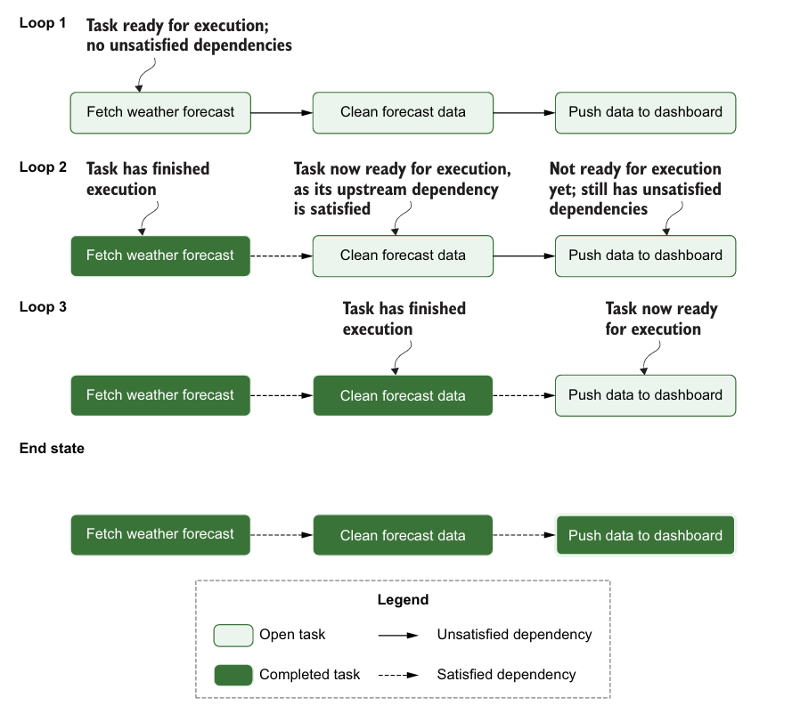
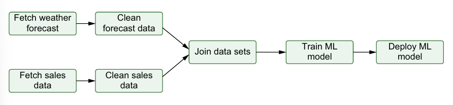
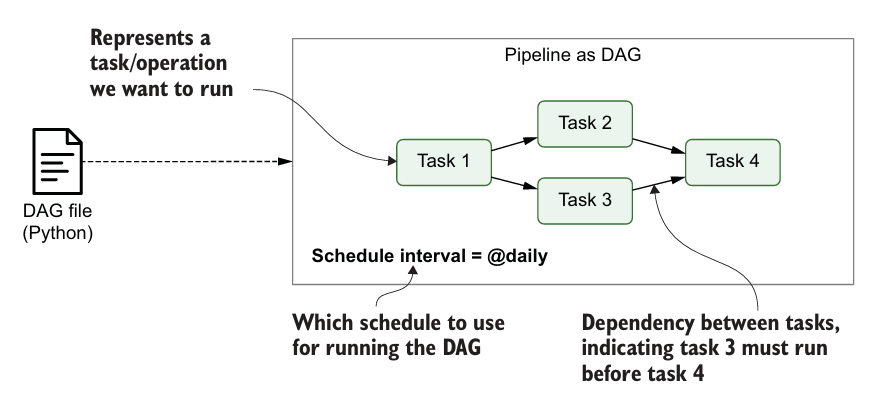
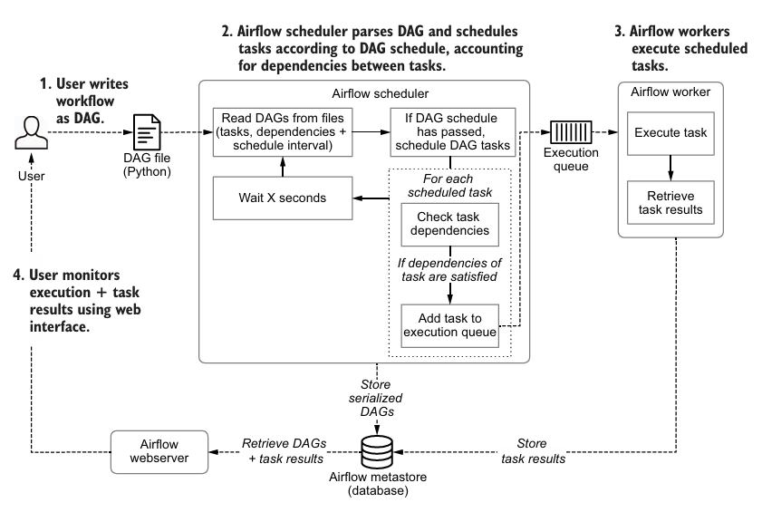
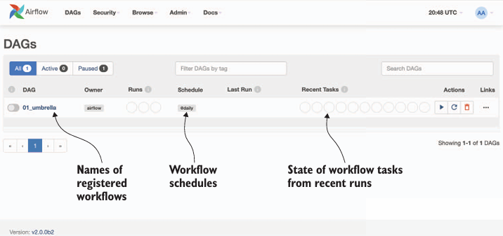
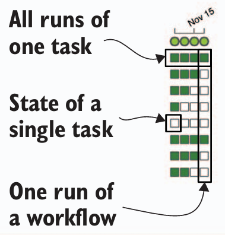

# Chapter 1 - Meet Apache Airflow

This book focuses on Apache Airflow, a batch-oriented framework for building data pipelines. Airflow’s key feature is that it enables you to easily build scheduled data pipelines using a flexible Python framework, while also providing many building blocks that allow you to stitch together the many different technologies encountered in modern technological landscapes. 

## 1.1 - Introducing data pipelines

Data pipelines generally consist of several tasks or actions that need to be executed to achieve the desired result

Example: Build a small weather dashboard:

- 1. Fetch weather forecasr data from a weather API
- 2. Clean, transform the fetched data
- 3. Push the transformed data to the weather dashboard

### 1.1.1 - Data pipelines as graphs

Tasks are represented as nodes in the graph, while dependencies between tasks are represented by directed edges between the task nodes (_directed graph_)

This type of graph is typically called a _directed acyclic graph_(DAG), as the graph contains _directed_ edges and does not contain any loops or cycles (_acyclic_)

### 1.1.2 - Executing a pipeline graph

Algorithm for running the pipeline

- For each open (=uncompleted) task in the graph: For each edge pointing _toward_ the task, check if the "upstream" task on the other end of the edge has been completed. If all upstream tasks have been completed, add the task under consideration to a queue of tasks to be executed
- Execute the tasks in the execution queue, marking them completed once they finish performing their work
- Jump back to step 1 and repeat until all tasks in the graph have been completed

### 1.1.3 - Pipeline graphs vs. sequential scripts

Advantages of the graph-based approach

In the graph representation, we need only to rerun any failing tasks (and any downstream dependencies).

### 1.1.4 - Running pipeline using workflow managers

## 1.2 - Introducing Airflow

### 1.2.1 - Defining pipelines flexibly in (Python) code

Each DAG file typically describes the set of tasks for a given DAG and the dependencies between the tasks, which are then parsed by Airflow to identify the DAG structure

Advantage: This programmatic approach provides a lot of flexibility:
- Example: Tou can use Python code to dynamically generate optional tasks depending on certain conditions or even generate entire DAGs based on external metadata or configuration files

### 1.2.2 - Scheduling and executing pipelines

Airflow is organized into three main components

- _The Airflow scheduler_ - Parses DAGs, checks schedule interval, and (if the DAGs’ schedule has passed) starts scheduling the DAGs’ tasks for execution by passing them to the Airflow workers.

- _The Airflow workers_ — Pick up tasks that are scheduled for execution and execute them. As such, the workers are responsible for actually “doing the work.”

- _The Airflow webserver_ — Visualizes the DAGs parsed by the scheduler and provides the main interface for users to monitor DAG runs and their results.

The heart of Airflow is arguably the scheduler

Once tasks have been queued for execution, they are picked up by a pool of Airflow workers that execute tasks in parallel and track their results. These results are communicated to Airflow’s metastore so that users can track the progress of tasks and view their logs using the Airflow web interface (provided by the Airflow webserver)

### 1.2.3 - Monitoring and handling failures

In addition to scheduing and executing DAGs, Airflow also provides an extensive web interface that can be used for viewing DAGs and monitoring the results of DAGs runs

### 1.2.4 - Incremental loading and backfilling

In these incremental pipelines, each DAG run processes only data for the corresponding time slot (the data's _delta_)

Schedule intervals become even more powerful when combined with the concept of _backfilling_, which allows you to execute a new DAG for historical schedule intervals that occurred in the past

## 1.3 - When to use Airflow

### 1.3.1 - Reasons to choose Airflow

### 1.3.2 - Reasons not to choose Airflow
- Streaming

## 1.4 - The rest of this book
