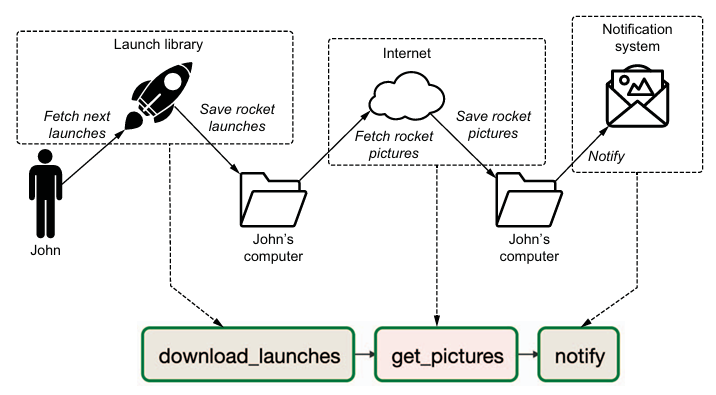
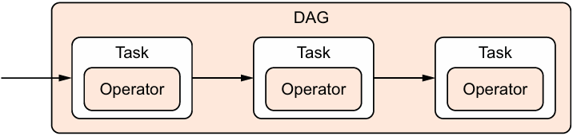

# Chapter 2 - Anatomy of an Airflow DAG

John's mental model mapped to tasks in Airflow

### 2.2.1 - Tasks vs. operators

In Airflow, _operators_ have a single piece of responsibility: they exist to perform one single piece of work. Some operators perform generic work, such as `BashOperator` run Bash script, `PythonOperator` run Python function; other have more specific use cases, such as `EmailOperator` send an email, `SimpleHTTPOperator` call an HTTP endpoint

The role of DAG is to orchestrate the execution of a collection of operators

The terms `operator` and `task` used interchangeably, they refer to the same thing but there is a difference. Tasks in Airflow manage the execution of an operator; they can be thought of a small wrapper or manager around an operator that ensures the operator excutes correctly

The user can focus on the work to be done by using operators, while Airflow ensures correct execution of the work via tasks

### 2.3.2 - Running Airflow in Docker containers

Not working any more

    docker run -ti `
    -p 8081:8080 `
    -v D:\repo_books\book_datapipelineswithapacheairflow\part01\chap02\rocket\download_rocket_launchers.py:/opt/airflow/dags/download_rocket_launchers.py `
    --entrypoint=/bin/bash `
    --name airflow-book apache/airflow:latest-python3.12 `
    -c "(airflow db init && airflow users create --username admin --password admin --firstname Do --lastname Dat --role Admin --email tadod.de@gmail.com); airflow webserver & airflow scheduler"
