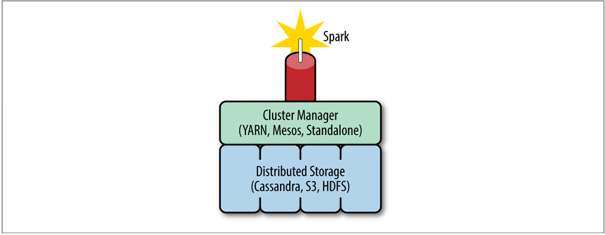
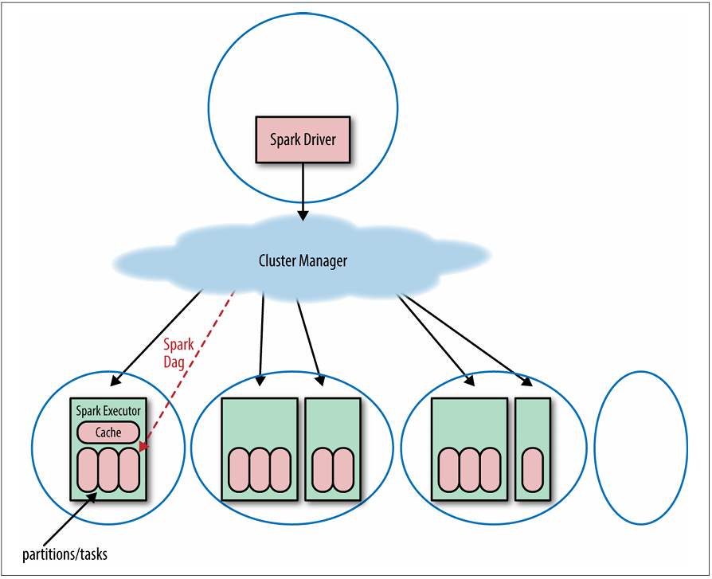
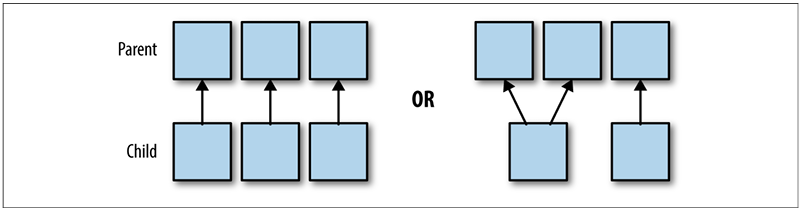
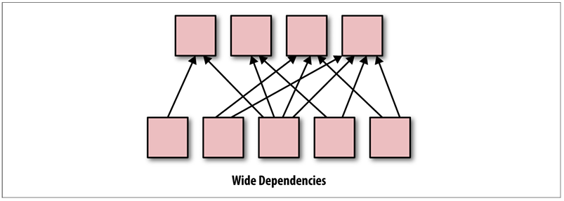
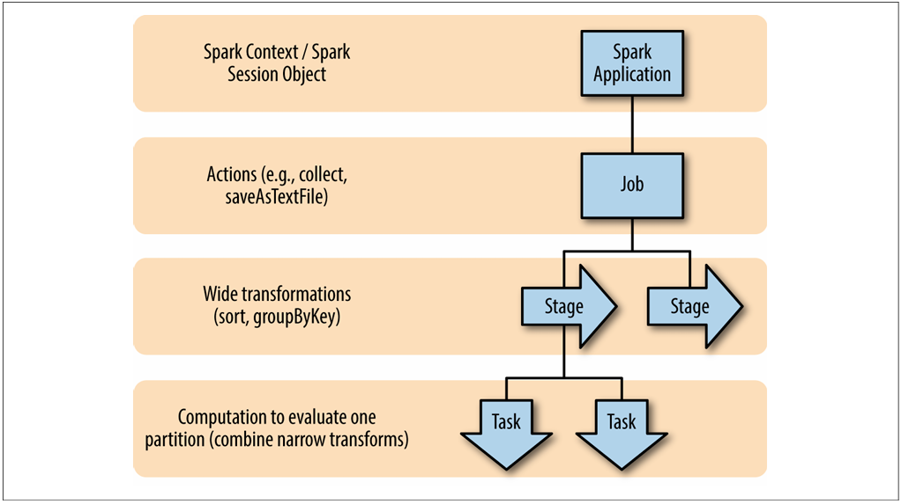
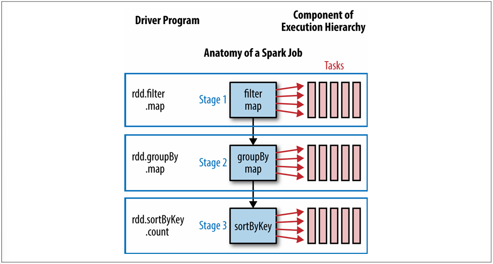

# Chapter 2 - How Spark Works

To get the most out of Spark, it is important to understand some of the principles used to design Spark and, at a cursory level, how Spark programs are executed

## How Spark Fits into the Big Data Ecosystem

Spark currently supports three kinds of cluster managers
- Standalone Cluster Manager
- Apache Mesos
- Hadoop YARN

## Spark Components

- Spark Core: The main data processing framework in the Spark ecosystem, has APIs in Scala, Java, Python, and R
- First-party components: Spark SQl, Spark MLlib, Spark ML, Spark Streaming, and GraphX

> Spark SQL has a different query optimizer than Spark Core

_Spark SQL_ is a component that can be used in tandem with Spark Core and has APIs in Scala, Java, Python, and R, and basic SQL queries. Spark SQL defines an interface for a semi-structured data type, called `DataFrames`, and as of Spark 1.6, a semi-structured, typed version of RDDs called `Datasets`

Spark has two machine learning packages
- Spark MLlib: A package of machine learning and statistics algorithms written with Spark
- Spark ML: provides a higher-level API than MLlib with the goal of allowing users to more easily create practical machine learning pipelines

> Spark MLlib is primarily built on top of RDDs and uses functions from Spark Core, while ML is built on top of Spark SQL `DataFrames`. Eventually the Spark community plans to move over to ML and deprecate MLlib

Spark Streaming uses the scheduling of the Spark Core for streaming analytics on minibatches of data

GraphX is a graph processing framework built on top of Spark with an API for graph computations

> This book will focus on optimizing programs written with the Spark Core and Spark SQL

## Spark Model of Parallel Computing: RDDs

Spark represents large datasets as RDDs - immutable, distributed collections of objects - which are stored in the executors (or slave nodes). The objects that comprise RDDs are called partitions and may be (but do not need to be) computed on different nodes of a distributed system

### Lazy Evaluation

Evaluation of RDDs is completely lazy. Spark does not begin computing the partitions until an action is called

Actions trigger the scheduler, which builds a directed acyclic graph (called the DAG), based on the dependencies between RDD transformations. In other words, Spark evaluates an action by working backward to define the series of steps it has to take to produce each object in the final distributed dataset (each partition)

> Not all transformations are 100% lazy (`sortByKey` involves both a transformation and an action)

**Lazy evaluation and fault tolerance** - If a partition is lost, the RDD has enough information about its lineage to recompute it, and that computation can be parallelized to make recovery faster

**Lazy evaluation and debugging** - ...Even the stack trace will show the failure as first occurring at the collect step, suggesting that the failure came from the collect statement. For this reason it is probably most efficient to develop in an environment that gives you access to complete debugging information

### In-Memory Persistence and Memory Management

Rather than writing to disk between each pass through the data, Spark has the option of keeping the data on the executors loaded into memory

Spark offers three options for memory management
- _In memory as deserialized Java objects_ (`persist()` default) - This form of in-memory storage is the fastest, since it reduces serialization time; however, it may not be the most memory efficient, since it requires the data to be stored as objects
- _As serialize data_ - Using the standard Java serialization library, Spark objects are converted into streams of bytes as they are moved around the network. This approach may be slower, since serialized data is more CPU-intensive to read than deserialized data; however, it is often more memory efficient, since it allows the user to choose a more efficient representation
- _On disk_ - RDDs, whose partitions are too large to be stored in RAM on each of the executors, can be written to disk. This strategy is obviously slower for repeated computations, but can be more fault-tolerant for long sequences of transformations

> The `persist()` function in the RDD class lets the user control how the RDD is stored. By default, `persist()` stores an RDD as deserialized objects in memory, but the user can pass one of numerous storage options to the `persist()` function to control how the RDD is stored

When persisting RDDs, the default implementation of RDDs evicts the least recently used partition (called LRU caching) if the space it takes is required to compute or to cache a new partition. However, you can change this behavior and control Spark’s memory prioritization with the `persistencePriority()` function in the RDD class.

### Immutability and the RDD Interface

Since RDDs are statically typed and immutable, calling a transformation on one RDD will not modify the original RDD but rather return a new RDD object with a new definition of the RDD’s properties

RDDs can be created in three ways
- By transforming an existing RDD
- From a `SparkContext` - API's gateway to Spark for your application - using the `makeRDD` or `parallelize` methods from a local Scala object or reading from stable storage
- Converting a `DataFrame` or `Dataset` (create from the `SparkSession`)

> `DataFrame` and `Dataset` can be read using the Spark SQL equivalent to a `SparkContext`, the `SparkSession`

Spark uses 5 main properties to represent an RDD
- (Required) The list of partition objects that make up the RDD
- (Required) A function for computing an iterator of each partition
- (Required) A list of dependencies on other RDDs
- (Optional) A partitioner (for RDDs of rows of key/value pairs represented as Scala tuples)
- (Optional) A list of preferred locations (for the HDFS file)

It is helpful to understand the properties and know how to access them for debugging and for a better conceptual understanding

- `partitions()` - Returns an array of the partition objects that make up the parts of the distributed dataset
- `iterator(p, parentIters)` -  Computes the elements of partition p given iterators for each of its parent partitions. This function is called in order to compute each of the partitions in this RDD. This is not intended to be called directly by the user. Rather, this is used by Spark when computing actions.
- `dependencies()` - Returns a sequence of dependency objects. The dependencies let the scheduler know how this RDD depends on other RDDs
    - _Narrow dependencies_ (`NarrowDependency` objects) - partitions depending on one or a small subset of partitions in the parent
    - _Wide dependencies_ (`ShuffleDependency` objects) - A partition can only be computed by rearraging all the data in the parent
- `partitioner()` -  Returns a Scala option type of a `partitioner` object if the RDD has a function between element and partition associated with it, such as a `hashPartitioner` (returns `None` for all RDDs that are not of type tuple - do not represent key/value data)
- `preferredLocations(p)` - Returns information about the data locality of a partition, `p`

### Types of RDDs

> Find out what type an RDD is by using the toDebugString function, which is defined on all RDDs. This will tell you what kind of RDD you have and provide a list of its parent RDDs

### Functions on RDDs: Transformations Versus Actions

Actions are functions that return something that is not an RDD, including a side effect, and transformations are functions that return another RDD

- Actions that bring data back to the driver include `collect`, `count`, `collectAsMap`, `sample`, `reduce`, and `take`

> In general, it is best to use actions like `take`, `count`, and `reduce`, which bring back a fixed amount of data to the driver, rather than `collect` or `sample`

- Actions that write to storage include `saveAsTextFile`, `saveAsSequenceFile`, and `saveAsObjectFile`

> Functions that return nothing (void in Java, or Unit in Scala), such as foreach, are also actions: they force execution of a Spark job

### Wide Versus Narrow Dependencies

Specifically, partitions in narrow transformations can either depend on one parent (such as in the `map` operator), or a unique subset of the parent partitions that is known at design time (`coalesce`)

In contrast, transformations with wide dependencies cannot be executed on arbitrary rows and instead require the data to be partitioned in a particular way, e.g., according the value of their key. In `sort`, for example, records have to be partitioned so that keys in the same range are on the same partition

> Transformations with wide dependencies include `sort`, `reduceByKey`, `groupByKey`, `join`, and anything that calls the `rePartition` function

The join functions are a bit more complicated, since they can have wide or narrow dependencies depending on how the two parent RDDs are partitioned

## Spark Job Scheduling

A Spark application consists of a driver process, which is where the high-level Spark logic is written, and a series of executor processes that can be scattered across the nodes of a cluster

One Spark cluster can run several Spark applications concurrently. Spark applications can, in turn, run multiple concurrent jobs. Jobs correspond to each action called on an RDD in a given application

### Resource Allocation Across Applications

Spark offers two ways of allocating resources across applications: 
- `Static allocation`
- `Dynamic allocation`

### The Spark Application

A Spark application begins when a `SparkContext` is started. The `SparkContext` determines how many resources are allotted to each executor. These parameters are exposed in the `SparkConf` object, which is used to create a `SparkContext` (**Appendix A**)

**Default Spark Scheduler** - FIFO (fisrt in, first out). However, Spark does offer a fair scheduler, which assigns tasks to concurrent jobs in round-robin fashion

## The Anatomy of a Spark Job

In the Spark lazy evaluation paradigm, a Spark application doesn’t “do anything” until the driver program calls an action. With each action, the Spark scheduler builds an execution graph and launches a Spark job. Each job consists of stages, which are steps in the transformation of the data needed to materialize the final RDD. Each stage consists of a collection of tasks that represent each parallel computation and are performed on the executors

An application corresponds to starting a `SparkContext`/`SparkSession`. Each _application_ may contain many jobs that correspond to one RDD action. Each _job_ may contain several stages that correspond to each wide transformation. Each _stage_ is composed of one or many tasks that correspond to a parallelizable unit of computation done in each stage. There is one _task_ for each partition in the resulting RDD of that stage

### The DAG

Spark’s high-level scheduling layer uses RDD dependencies to build a _Directed Acyclic Graph_ (a DAG) of stages for each Spark job

> The DAG builds a graph of stages for each job, determines the locations to run each task, and passes that information on to the TaskScheduler, which is responsible for running tasks on the cluster. The TaskScheduler creates a graph with dependencies between partitions

### Jobs

A Spark job is the highest element of Spark’s execution hierarchy. Each Spark job corresponds to one action, and each action is called by the driver program of a Spark application

> In graph theory, we would say the action forms a “leaf” in the DAG

### Stages

The action may include one or several transformations, and wide transformations define the breakdown of jobs into `stages`

Each stage corresponds to a shuffle dependency created by a wide transformation in the Spark program. At a high level, one stage can be thought of as the set of computations (tasks) that can each be computed on one executor without communication with other executors or with the driver. Several transformations with narrow dependencies can be grouped into one stage.

> Because the stage boundaries require communication with the driver, the stages associated with one job generally have to be executed in sequence rather than in parallel. It is possible to execute stages in parallel if they are used to compute different RDDs that are combined in a downstream transformation such as a join. However, the wide transformations needed to compute one RDD have to be computed in sequence. Thus it is usually desirable to design your program to require fewer shuffles.

### Tasks

A stage consists of tasks. The task is the smallest unit in the execution hierarchy, and each can represent one local computation. All of the tasks in one stage execute the same code on a different piece of the data

> One task cannot be executed on more than one executor. The number of tasks per stage corresponds to the number of partitions in the output RDD of that stage

    def simpleSparkProgram(rdd : RDD[Double]): Long ={
    //stage1
        rdd.filter(_< 1000.0)
           .map(x => (x, x) )
    //stage2
           .groupByKey()
           .map{ case(value, groups) => (groups.sum, value)}
    //stage 3
           .sortByKey()
           .count()
    }

A cluster cannot necessarily run every task in parallel for each stage. Each executor has a number of cores. The number of cores per executor is configured at the application level, but likely corresponding to the physical cores on a cluster. Spark can run no more tasks at once than the total number of executor cores allocated for the application. We can calculate the number of tasks from the settings from the Spark Conf as (total number of executor cores = # of cores per executor × number of executors)

## Conclusion

Thus, it is important to understand how the execution model for your code is assembled in order to write and debug Spark code