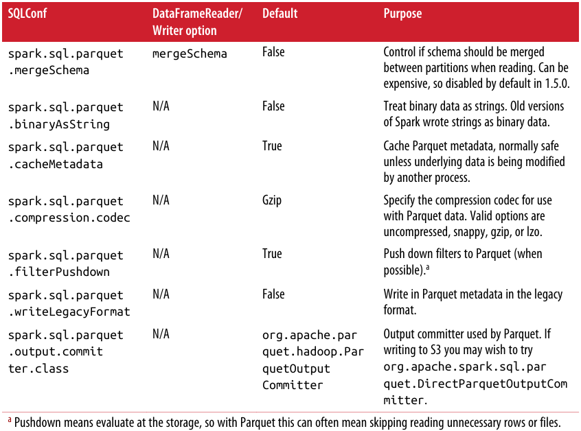

# Chapter 3 - DataFrames, Datasets, and Spark SQL

Spark SQL and its DataFrames and Datasets interfaces are the future of Spark performance, with more efficient storage options, advanced optimizer, and direct operations on serialized data


> This chapter focus on how to best use Spark SQL's tools and how to intermix Spark SQL with traditional Spark operations

Like RDDs, `DataFrames` and `Datasets` represent distributed collections, with additional schema information not found in RDDs, provide a more efficient

- Storage layer (Tungsten)
- Optimization (Catalyst can perform additional optimizations)

> `DataFrames` are `Datasets` of a special Row object, which doesn’t provide any compile-time type checking

## Getting Started with the SparkSession (or Hive Context or SQLContext)

Much as the `SparkContext` is the entry point for all Spark applications, and the `StreamingContext` is for all streaming applications, the `SparkSession` serves as the entry point for Spark SQL

One of the more important shortcuts is `enableHiveSupport()`, which will give you access to Hive UDFs and _does not require_ a Hive installation—but does require certain extra JARs

    val spark = SparkSession
        .builder()
        .appName("chap03-01")
        .master("spark://spark-master:7077")
        .config("spark.executor.memory", "512m")
        .enableHiveSupport()
        .getOrCreate()

## Spark SQL Dependencies

Add Spark SQL and Hive component to sbt build

    libraryDependencies ++= Seq(
        "org.apache.spark" %% "spark-sql" % "2.0.0",
        "org.apache.spark" %% "spark-hive" % "2.0.0")

Add Spark SQL and Hive component to Maven pom file

    <dependency> <!-- Spark dependency -->
        <groupId>org.apache.spark</groupId>
        <artifactId>spark-sql_2.11</artifactId>
        <version>2.0.0</version>
    </dependency>
    <dependency> <!-- Spark dependency -->
        <groupId>org.apache.spark</groupId>
        <artifactId>spark-hive_2.11</artifactId>
        <version>2.0.0</version>
    </dependency>

## Basics of Schemas

The schema information, and the optimizations it enables, is one of the core differences between Spark SQL and core Spark

`printSchema()` will show us the schema of a DataFrame and is most commonly used when working in the shell to figure out what you are working with

    case class StructField(
        name: String,
        dataType: DataType,
        nullable: Boolean = true,
        metadata: Metadata = Metadata.empty)
    ....

The first part is a `StructType`, which contains a list of fields. It’s important to note you can nest `StructTypes`, like how a case class can contain additional case classes. The fields in the `StructType` are defined with `StructField`, which specifies the name, type and a Boolean indicating if the field may be null/missing

## DataFrame API

### Transformations

As with RDDs, we can broadly break down transformations into simple single `DataFrame`, multiple `DataFrame`, key/value, and grouped/windowed transformations

> Spark SQL transformations are only partially lazy; the schema is eagerly evaluated

**Simple DataFrame transformations and SQL expressions**

Simple `DataFrame` transformations allow us to do most of the standard things one can do when working a row at a time (meaning narrow transformations)

`DataFrame` functions, like `filter`, accept Spark SQL expressions instead of lambdas. These expressions allow the optimizer to understand what the condition represents, and with `filter`, it can often be used to skip reading unnecessary records

    df.filter(df("happy") !== true)
    df.filter(!$("happy") !== true)

    // more complex
    df.filter(
        df("happy")
            .and(df("attributes")(0) > df("attributes)(1))
    )

Spark SQL’s column operators are defined on the column class, so a filter containing the expression `0 >= df.col("friends")` will not compile since Scala will use the `>=` defined on 0. Instead you would write `df.col("friend") <= 0` or convert 0 to a column literal with `lit`

> Columns use `===` and `!==` for equality to avoid conflict with Scala internals

Spark SQL Scala operators


Spark SQL standard functions on columns


Functions for use on Spark SQL arrays


**Specialized DataFrame transformations for missing and noisy data**

By using `isNan` or `isNull` along with filters, you can create conditions for the rows you want to keep. Or use `coalesce(c1, c2, ...)` to return the first nonnull column

For numeric data, `nanvl` returns the first non-NAN value `nanvl(0/0, sqrt(-2), 3) ==> 3`

**Beyond row-by-row transformations**

Spark SQL allows us to select the unique rows by calling `dropDuplicates`, but as with the similar operation on RDDs (`distinct`), this can require a shuffle, so is often much slower than `filter`

    pandas.dropDuplicates(List("id"))

**Aggregates and groupBy**

Aggregations on `Datasets` have extra functionality, returning a `GroupedDataset` (in pre-2.0 versions of Spark) or a `KeyValueGroupedDataset` when grouped with an arbitrary function, and a `RelationalGroupedDataset` when grouped with a relational/Dataset DSl expression

`min`, `max`, `avg`, and `sum` are all implemented as convenience functions directly on `GroupedData`, and more can be specified by providing the expressions to `agg`

    def maxPandaSizePerZip(pandas: DataFrame): DataFrame = {
        pandas.groupBy(pandas("zip")).max("pandaSize")
    }

    // Compute the count, mean, stddev, min, max summary stats for all
    // of the numeric fields of the provided panda infos. non-numeric
    // fields (such as string (name) or array types) are skipped.
    val df = pandas.describe()
    // Collect the summary back locally
    println(df.collect())

For computing multiple different aggregations, or more complex aggregations, you should use the `agg` API on the `GroupedData` instead of directly calling count, mean, or similar convenience functions

    def minMeanSizePerZip(pandas: DataFrame): DataFrame = {
        // Compute the min and mean
        pandas
            .groupBy(pandas("zip"))
            .agg(
                min(pandas("pandaSize")),
                mean(pandas("pandaSize"))
            )
    }

Spark SQL aggregate functions for use with agg API


**Windowing**

When creating a window you specify what columns the window is over, the order of the rows within each partition/group, and the size of the window

    val windowSpec = Window
        .orderBy(pandas("age"))
        .partitionBy(pandas("zip"))
        .rowsBetween(start = -10, end = 10)
        // can use rangeBetween for range instead

    val pandaRelativeSizeCol =
        pandas("pandaSize") - avg(pandas("pandaSize")).over(windowSpec)

    pandas.select(
        pandas("name"),
        pandas("zip"),
        pandas("pandaSize"),
        pandas("age"),
        pandaRelativeSizeCol.as("panda_relative_size")
    )

**Sorting**

    pandas.orderBy(pandas("pandaSize").asc, pandas("age").desc)

### Multi-DataFrame Transformation

**Set-like operations**

| Operation name | Cost      |
| -------------- | --------- |
| `unionAll`     | Low       |
| `intersect`    | Expensive |
| `except`       | Expensive |
| `distinct`     | Expensive |

### Plain Old SQL Queries and Interacting with Hive Data

If you are connected to a Hive Metastore we can directly write SQL queries against the Hive tables and get the results as a `DataFrame`. If you have a `DataFrame` you want to write SQL queries against, you can register it as a temporary table

    def registerTable(df: DataFrame): Unit = {
        // registering
        df.registerTempTable("pandas")
        // saving
        df.write.saveAsTable("perm_pandas")
    }

    def querySQL(): DataFrame = {
        sqlContext.sql("SELECT * FROM pandas WHERE size > 0")
    }

## Data Representation in DataFrames and Datasets

Something about Tungsten

## Data Loading and Saving Functions

Spark SQL has a different way of loading and saving data than core Spark. To be able to push down certaintypes of operations to the storage layer, Spark SQL has its own Data Source API

### DataFrameWriter and DataFrameReader

The `DataFrameWriter` is accessed by calling `write` on a `DataFrame` or `Dataset`. The `DataFrameReader` can be accessed through `read` on a `SQLContext`

### Formats

**JSON**

Spark SQL is able to infer a schema for us by sampling the records. Loading JSON data is more expensive than loading many data sources, since Spark needs to read some of the records to determine the schema information

If the schema between records varies widely (or the number of records is very small),you can increase the percentage of records read to determine the schema by setting `samplingRatio` to a higher value

    val df2 = session.read.format("json")
        .option("samplingRatio", "1.0")
        .load(path)

**JDBC**

The JDBC data source represents a natural Spark SQL data source, one that supports many of the same operations

> You need to add the JAR for your JDBC data sources

If you are submitting your Spark job with `spark-submit` you can download the required JARs to the host you are launching and include them by specifying `--jars` or supply the Maven coordinates to `--packages`

    spark-submit --jars ./resources/mysql-connector-java-5.1.38.jar, ./path/to/another/jar

> **JdbcDialects** allow Spark to correctly map the JDBC types to the corresponding Spark SQL types

The convenience wrapper `JDBC` accepts the URL, table, and a `java.util.Properties` object for connection properties (such as authentication information)

    spark.read.jdbc("jdbc:dialect:serverName;user=user;password=pass", "table", new Properties)

    spark.read.format("jdbc")
        .option("url", "jdbc:dialect:serverName")
        .option("dbtable", "table").load()

 The API for saving a `DataFrame` is very similar to the API used for loading. The `save()` function needs no path since the information is already specified

    df.write.jdbc("jdbc:dialect:serverName;user=user;password=pass", "table", new Properties)

    df.write.format("jdbc")
        .option("url", "jdbc:dialect:serverName")
        .option("user", "user")
        .option("password", "pass")
        .option("dbtable", "table").save()

**Parquet**

Apache Parquet’s popularity comes from a number of features, including the ability to easily split across multiple files, compression, nested types, and many others discussed in the Parquet documentation

Parquet data source option



More code in [SQLDataSourceExample.scala](../code/SQLDataSourceExample.scala)

**Hive tables**

One option for bringing in data from a Hive table is writing a SQL query against it and having the result as a `DataFrame`

    // Initialize a Spark session with Hive support enabled and configures it to connect to a Hive Metastore.
    val sparkSession = SparkSession.builder()
        .appName("example-spark-scala-read-and-write-from-hive")
        .config("hive.metastore.warehouse.dir", params.hiveHost + "user/hive/warehouse")
        .enableHiveSupport()
        .getOrCreate()

    // Read entire HIVE table
    df = spark.table(<HIVE_DB>.<HIVE_TBL>)

    // Read the partial table based on SQL query
    df = spark.sql(<YOUR_SQL_QUERY>)

    // Write
    df.write.saveAsTable("pandas")

When loading a Hive table Spark SQL will convert the metadata and cache the result. If the underlying metadata has changed you can use `sqlContext.refreshTable("tablename")` to update the metadata, or the caching can be disabled by setting `spark.sql.parquet.cacheMetadata` to false.

**RDDs**

Spark SQL `DataFrames` can easily be converted to RDDs of `Row` objects, and can also be created from RDDs of `Row` objects as well as JavaBeans, Scala case classes, and tuples

> RDDs are a special-case data source, since when going to/from RDDs, the data remains inside of Spark without writing out to or reading from an external system

>  Converting a DataFrame to an RDD is a transformation (not an action); however, converting an RDD to a DataFrame or Dataset may involve computing (or sampling some of) the input RDD

When you create a `DataFrame` from an RDD, Spark SQL needs to add schema information. If you are creating the DataFrame from an RDD of case classes or plain old Java objects (POJOs), Spark SQL is able to use reflection to automatically determine the schema

    def createFromCaseClassRDD(input: RDD[PandaPlace]) = {
        // Create DataFrame explicitly using spark session and schema inference
        val df1 = spark.createDataFrame(input)

        // Create DataFrame using session implicits and schema inference
        val df2 = input.toDF()

        // Create a Row RDD from our RDD of case classes
        val rowRDD = input.map(pm => Row(pm.name,
            pm.pandas.map(pi => Row(pi.id, pi.zip, pi.happy, pi.attributes))))

        val pandasType = ArrayType(StructType(List(
            StructField("id", LongType, true),
            StructField("zip", StringType, true),
            StructField("happy", BooleanType, true),
            StructField("attributes", ArrayType(FloatType), true)
        )))

        // Create DataFrame explicitly with specified schema
        val schema = StructType(List(
            StructField("name", StringType, true),
            StructField("pandas", pandasType)
        ))

        val df3 = session.createDataFrame(rowRDD, schema)
    }

Converting a DataFrame to an RDD is incredibly simple; however, you get an RDD of `Row` objects. Since a row can contain anything, you need to specify the type (or cast the result) as you fetch the values for each column in the row. With Datasets you can directly get back an RDD templated on the same type, which can make the conversion back to a useful RDD much simpler.

    // Convert a DataFrame
    def toRDD(input: DataFrame): RDD[RawPanda] = {
        val rdd: RDD[Row] = input.rdd  // dataframe to rdd
        rdd.map(
            row => RawPanda(row.getAs[Long](0),
                            row.getAs[String](1),
                            row.getAs[String](2),
                            row.getAs[Boolean](3),
                            row.getAs[Array[Double]](4)))
    }

**Local collections**

The same memory requirements apply; namely, the entire contents of the DataFrame will be in-memory in the driver program

    def createFromLocal(input: Seq[PandaPlace]) = {
        session.createDataFrame(input)
    }

Collecting the result locally

    def collectDF(df: DataFrame) = {
        val result: Array[Row] = df.collect()
        result
    }

> Just as with RDDs, do not collect large DataFrames back to the driver. For Python users, it is important to remember that toPan das() collects the data locally

**Additional formats**

As with core Spark, the data formats that ship directly with Spark only begin to scratch the surface of the types of systems with which you can interact. Some vendors publish their own implementations, and many are published on Spark Packages

Spark packages can be included in your application in a few different ways
- At runtime: Using `--packages` on the command line
- At compile time: 2 options
    - Add the Maven coordinates to your builds
    - Build with sbt

```
./bin/spark-shell --packages com.databricks:spark-csv_2.11:1.5.0    

"com.databricks" % "spark-csv_2.11" % "1.5.0"
```

### Save Modes

In core Spark, saving RDDs always requires that the target directory does not exist, which can make appending to existing tables challenging. With Spark SQL, you can specify the desired behavior when writing out to a path that may already have data

| Save Mode | Behavior |
|-----------|----------|
| `ErrorIfExists` | Throws an exception if the target already exists. If target doesn’t exist write the data out. |
| `Append` | If target already exists, append the data to it. If the data doesn't exist write the data out. |
| `Overwrite` | If the target already exists, delete the target. Write the data out. |
| `Ignore` | If the target already exists, silently skip writing out. Otherwise write out the data. |

### Partitions (Discovery and Writing)

Partition data is an important part of Spark SQL since it powers one of the key optimizations to allow reading only the required data. If you know how your downstream consumers may access your data (e.g., reading data based on zip code), when you write your data it is beneficial to use that information to partition your output

> When reading the data, it’s useful to understand how partition discovery functions, so you can have a better understanding of whether your filter can be pushed down

Save partitioned by zip code

    def writeOutByZip(input: DataFrame): Unit = {
        input.write.partitionBy("zipcode")
            .format("json")
            .save("output/")
    }

In addition to splitting the data by a partition key, it can be useful to make sure the resulting file sizes are reasonable, especially if the results will be used downstream by another Spark job.

## Datasets

## Extending with User-Defined Functions and Aggregate Functions (UDFs, UDAFs)

## Query Optimizer

## Debugging Spark SQL Queries

## JDBC/ODBC Server

## Conclusion
