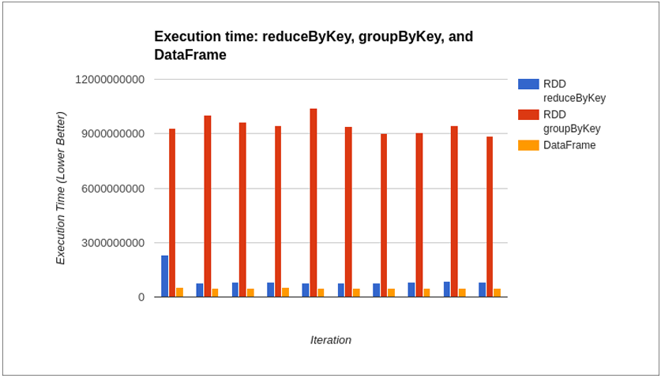
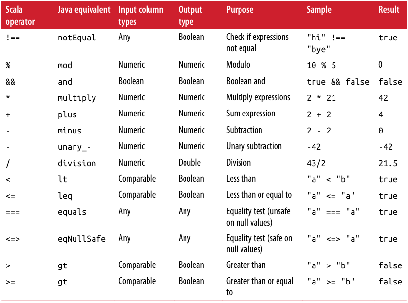
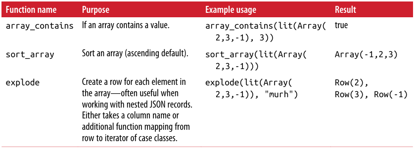
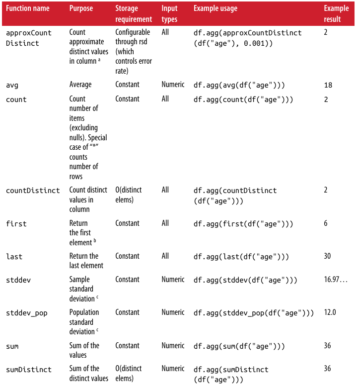
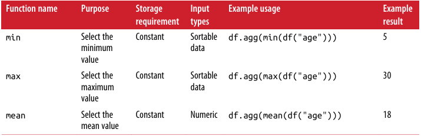

# Chapter 3 - DataFrames, Datasets, and Spark SQL

Spark SQL and its DataFrames and Datasets interfaces are the future of Spark performance, with more efficient storage options, advanced optimizer, and direct operations on serialized data

> This chapter focus on how to best use Spark SQL's tools and how to intermix Spark SQL with traditional Spark operations

Like RDDs, `DataFrames` and `Datasets` represent distributed collections, with additional schema information not found in RDDs, provide a more efficient
- Storage layer (Tungsten)
- Optimization (Catalyst can perform additional optimizations)

> `DataFrames` are `Datasets` of a special Row object, which doesn’t provide any compile-time type checking

## Getting Started with the SparkSession (or Hive Context or SQLContext)

Much as the `SparkContext` is the entry point for all Spark applications, and the `StreamingContext` is for all streaming applications, the `SparkSession` serves as the entry point for Spark SQL

One of the more important shortcuts is `enableHiveSupport()`, which will give you access to Hive UDFs and _does not require_ a Hive installation—but does require certain extra JARs

    val spark = SparkSession
        .builder()
        .appName("chap03-01")
        .master("spark://spark-master:7077")
        .config("spark.executor.memory", "512m")
        .enableHiveSupport()
        .getOrCreate()

## Spark SQL Dependencies

Add Spark SQL and Hive component to sbt build
    
    libraryDependencies ++= Seq(
        "org.apache.spark" %% "spark-sql" % "2.0.0",
        "org.apache.spark" %% "spark-hive" % "2.0.0")

Add Spark SQL and Hive component to Maven pom file

    <dependency> <!-- Spark dependency -->
        <groupId>org.apache.spark</groupId>
        <artifactId>spark-sql_2.11</artifactId>
        <version>2.0.0</version>
    </dependency>
    <dependency> <!-- Spark dependency -->
        <groupId>org.apache.spark</groupId>
        <artifactId>spark-hive_2.11</artifactId>
        <version>2.0.0</version>
    </dependency>

## Basics of Schemas

The schema information, and the optimizations it enables, is one of the core differences between Spark SQL and core Spark

`printSchema()` will show us the schema of a DataFrame and is most commonly used when working in the shell to figure out what you are working with

    case class StructField(
        name: String,
        dataType: DataType,
        nullable: Boolean = true,
        metadata: Metadata = Metadata.empty)
    ....

The first part is a `StructType`, which contains a list of fields. It’s important to note you can nest `StructTypes`, like how a case class can contain additional case classes. The fields in the `StructType` are defined with `StructField`, which specifies the name, type and a Boolean indicating if the field may be null/missing

## DataFrame API

### Transformations

As with RDDs, we can broadly break down transformations into simple single `DataFrame`, multiple `DataFrame`, key/value, and grouped/windowed transformations

> Spark SQL transformations are only partially lazy; the schema is eagerly evaluated

**Simple DataFrame transformations and SQL expressions**

Simple `DataFrame` transformations allow us to do most of the standard things one can do when working a row at a time (meaning narrow transformations)

`DataFrame` functions, like `filter`, accept Spark SQL expressions instead of lambdas. These expressions allow the optimizer to understand what the condition represents, and with `filter`, it can often be used to skip reading unnecessary records

    df.filter(df("happy") !== true)
    df.filter(!$("happy") !== true)

    // more complex
    df.filter(
        df("happy")
            .and(df("attributes")(0) > df("attributes)(1))
    )

Spark SQL’s column operators are defined on the column class, so a filter containing the expression `0 >= df.col("friends")` will not compile since Scala will use the `>=` defined on 0. Instead you would write `df.col("friend") <= 0` or convert 0 to a column literal with `lit`

> Columns use `===` and `!==` for equality to avoid conflict with Scala internals

Spark SQL Scala operators

Spark SQL standard functions on columns

Functions for use on Spark SQL arrays

**Specialized DataFrame transformations for missing and noisy data**

By using `isNan` or `isNull` along with filters, you can create conditions for the rows you want to keep. Or use `coalesce(c1, c2, ...)` to return the first nonnull column

For numeric data, `nanvl` returns the first non-NAN value `nanvl(0/0, sqrt(-2), 3) ==> 3`

**Beyond row-by-row transformations**

Spark SQL allows us to select the unique rows by calling `dropDuplicates`, but as with the similar operation on RDDs (`distinct`), this can require a shuffle, so is often much slower than `filter`

    pandas.dropDuplicates(List("id"))

**Aggregates and groupBy**

Aggregations on `Datasets` have extra functionality, returning a `GroupedDataset` (in pre-2.0 versions of Spark) or a `KeyValueGroupedDataset` when grouped with an arbitrary function, and a `RelationalGroupedDataset` when grouped with a relational/Dataset DSl expression

`min`, `max`, `avg`, and `sum` are all implemented as convenience functions directly on `GroupedData`, and more can be specified by providing the expressions to `agg`

    def maxPandaSizePerZip(pandas: DataFrame): DataFrame = {
        pandas.groupBy(pandas("zip")).max("pandaSize")
    }

    // Compute the count, mean, stddev, min, max summary stats for all
    // of the numeric fields of the provided panda infos. non-numeric
    // fields (such as string (name) or array types) are skipped.
    val df = pandas.describe()
    // Collect the summary back locally
    println(df.collect())

For computing multiple different aggregations, or more complex aggregations, you should use the `agg` API on the `GroupedData` instead of directly calling count, mean, or similar convenience functions

    def minMeanSizePerZip(pandas: DataFrame): DataFrame = {
        // Compute the min and mean
        pandas
            .groupBy(pandas("zip"))
            .agg(
                min(pandas("pandaSize")), 
                mean(pandas("pandaSize"))
            )
    }

Spark SQL aggregate functions for use with agg API

**Windowing**

When creating a window you specify what columns the window is over, the order of the rows within each partition/group, and the size of the window

    val windowSpec = Window
        .orderBy(pandas("age"))
        .partitionBy(pandas("zip"))
        .rowsBetween(start = -10, end = 10) 
        // can use rangeBetween for range instead

    val pandaRelativeSizeCol = 
        pandas("pandaSize") - avg(pandas("pandaSize")).over(windowSpec)

    pandas.select(
        pandas("name"), 
        pandas("zip"), 
        pandas("pandaSize"), 
        pandas("age"), 
        pandaRelativeSizeCol.as("panda_relative_size")
    )

**Sorting**

    pandas.orderBy(pandas("pandaSize").asc, pandas("age").desc)

### Multi-DataFrame Transformation

**Set-like operations**

| Operation name | Cost      |
|----------------|-----------|
| `unionAll`     | Low       |
| `intersect`    | Expensive |
| `except`       | Expensive |
| `distinct`     | Expensive |

### Plain Old SQL Queries and Interacting with Hive Data

If you are connected to a Hive Metastore we can directly write SQL queries against the Hive tables and get the results as a `DataFrame`. If you have a `DataFrame` you want to write SQL queries against, you can register it as a temporary table

    def registerTable(df: DataFrame): Unit = {
        // registering
        df.registerTempTable("pandas")
        // saving
        df.write.saveAsTable("perm_pandas")
    }

    def querySQL(): DataFrame = {
        sqlContext.sql("SELECT * FROM pandas WHERE size > 0")
    }

## Data Representation in DataFrames and Datasets

Something about Tungsten

## Data Loading and Saving Functions

Spark SQL has a different way of loading and saving data than core Spark. To be able to push down certaintypes of operations to the storage layer, Spark SQL has its own Data Source API

### DataFrameWriter and DataFrameReader

67/356

## Datasets

## Extending with User-Defined Functions and Aggregate Functions (UDFs, UDAFs)

## Query Optimizer

## Debugging Spark SQL Queries

## JDBC/ODBC Server

## Conclusion