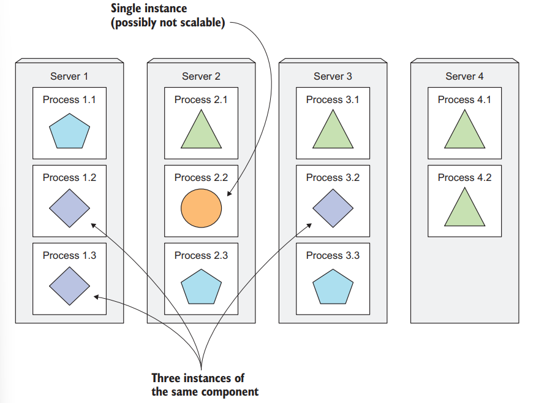
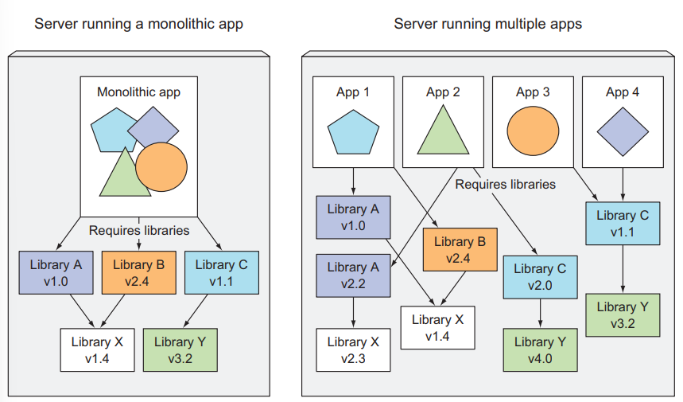
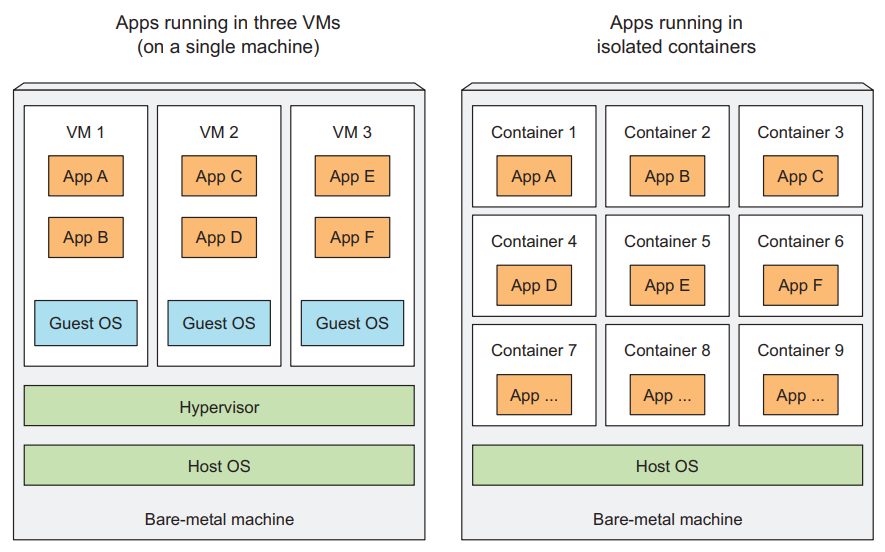
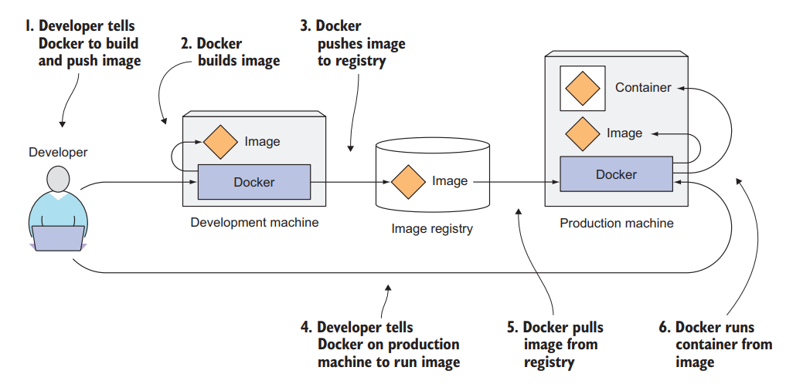
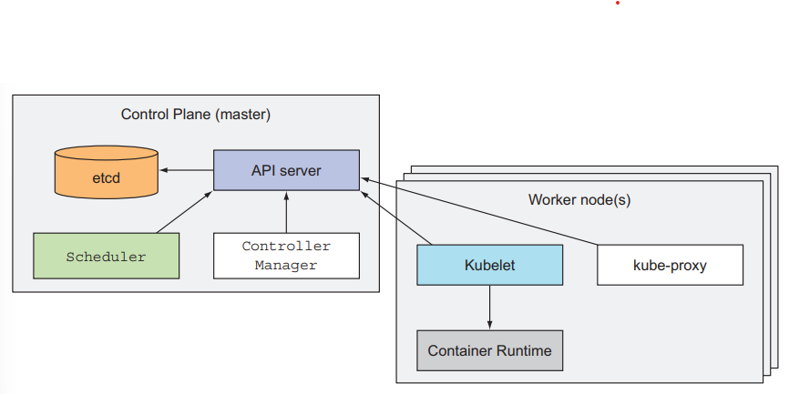

# Chapter 1 - Introducing Kubernetes

## 1.1. Understanding the need for a system like Kubernetes

### 1.1.1. Moving from monolithic apps to microvervices

Microservices communicate through
- Synchronous protocols: HTTP, RESTful (Representational State Transfer) APIs
- Asynchronous protocols: such as AMQP (Advanced Message Queueing Protocol)

**SCALING MICROSERVICES** - only those services that require more resources

**DEPLOYING MICROSERVICES**

> Drawbacks: number of inter-dependencies between the components increases

Debug and trace execution calls: Using distributed tracing systems such as Zipkin

The bigger the number of components you need to deploy on the same host, the harder it will be to manage all their dependencies to satisfy all their requirements

### 1.1.2. Providing a consistent environment to applications

It would be ideal if applications could run in the exact same environment during development and in production so they have the exact same operating system, libraries, system configuration, networking environment, and everything els

### 1.1.3. Moving to continuous delivery: DevOps and NoOps

- Developers: creating new features and improving the user experience, don’t normally want to be the ones making sure that the underlying operating system is up to date with all the security patches and things like that

- Ops team: care about system security, utilization, and other aspects that aren’t a high priority for developers. The ops people don’t want to deal with the implicit interdependencies of all the application components and don’t want to think about how changes to either the underlying operating system or the infrastructure can affect the operation of the application as a whole, but they must

> Kubernetes enables us to achieve all of this. By abstracting away the actual hardware and exposing it as a single platform for deploying and running apps, it allows developers to configure and deploy their applications without any help from the sysadmins and allows the sysadmins to focus on keeping the underlying infrastructure up and running, while not having to know anything about the actual applications running on top of it

## 1.2. Introducing container technologies

Kubernetes uses Linux container technologies to provide isolation of running applications

### 1.2.1. Understanding what containers are

VM Problem: wasting hardware resources + needs to be configured and managed individually = wasting human resources

**ISOLATING COMPONENTS WITH LINUX CONTAINER TECHNOLOGIES**

Using Linux container technologies: run multiple services on the same host machine, while not only exposing a different environment to each of them, but also isolating them from each other, similarly to VMs, but with much less overhead

A process running in a container runs inside the host's operating system, but the process in the container is still isolated from other processes

**COMPARING VIRTUAL MACHINES TO CONTAINERS**

Containers are much more lightweight
- VM needs to run its own set of system processes which requires additional compute resources
- Container is nothing more than a single isolated process running in the host OS, consuming only the resources that the app contumes

**INTRODUCING THE MECHANISMS THAT MAKE CONTAINER ISOLATION POSSIBLE**

- _Linux Namespaces_ - Makes sure each process sees its own personal view of the system (files, processes, network interfaces, hostname, ...)
- _Linux Conttrol Groups (cgroups)_ - Limit the amount of resources the process can consume (CPU, memory, network bandwidth, ...)

**ISOLATING PROCESSES WITH LINUX NAMESPACES**

All system resources, such as filesystems, process IDs, user IDs, network interfaces, and others, belong to the single namespace (You can create additional namespaces and organize resources across them)

Multiple kinds of namespaces exist, so a process doesn't belong to one namespace, but to one namespace of each kind
- Mount (mnt)
- Process ID (pid)
- Network (net)
- Inter-process communication (ipc)
- UTS (About hostname and domain name)
- User ID (user)

**LIMITING RESOURCES AVAILABLE TO A PROCESS**

Cgroups limits the resource usage of a process (or a group of processes)

### 1.2.2. Introducing the Docker container platform

A big difference between Docker-based container images and VM images is that container images are composed of layers, which can be shared and reused across multiple images

**UNDERSTANDING DOCKER CONCEPTS**

Three main concepts in Docker
- _Images_ - A Docker-based container image is something you package your application and its environment into
- _Registries_ - A Docker Registry is a repository that stores your Docker images and facilitates easy sharing os those images between different people and computers
- _Containers_ - A Docker-based container is a regular Linux container created from a Docker-based container image

> It should also be clear that a containerized app built for a specific hardware architecture can only run on other machines that have the same architecture. You can’t containerize an application built for the x86 architecture and expect it to run on an ARM-based machine because it also runs Docker. You still need a VM for that

### 1.2.3. Introducing rkt - an alternative to Docker

SKIP

## 1.3. Introducing Kubernetes

### 1.3.1. Understanding its origins

### 1.3.2. Looking at Kubernetes from the top of a mountain

Kubernetes abstracts away the underlying infrastructure and simplifies development, deployment, and management for both development and the operations teams

**UNDERSTANDING THE CORE OF WHAT KUBERNETES DOES**

The developer can specify that certain apps must run together and Kubernetes will deploy them on the same worker node. Others will be spread around the cluster, but they can talk to each other in the same way, regardless of where they’re deployed

### 1.3.3. Understanding the architecture of a Kubernetes cluster

At the hardware level, a Kubernetes cluster is composed of many nodes, which can be split into two types
- The _master_ node, which hosts the _Kubernetes Control Plane_ that controls and manages the whole Kubernetes system
- _Worker_ nodes that run the actual application you deploy

**THE CONTROL PLANE** - Controls the cluster and makes it function. It consists of multiple components that can run on a single master node or be split across multiple nodes and replicated to ensure high acailability

- The _Kubernetes API Server_, which you and the other Control Plane components communicate with (if replicate)
- The _Scheduler_: Schedules - Assigns a worker node to each deployable component of your application
- The _Controller Manager_ performs cluster-level functions, such as replicating components, keeping track of worker nodes, handling node failures, ...
- _etcd_ - a reliable distributed data store that persistently stores the cluster configuration

> The components of the Control Plane hold and control the state of the cluster, but they don't run your application. This is done by the (worker) nodes

**THE NODES** - The worker nodes are the machines that run your containerized applications. The task of running, monitoring, and providing services to your application is done by the following components

- Docker, or another _container runtime_, which runs your containers
- The _Kubelet_ - talks to API server and manages containers on its node
- The _Kubernetes Service Proxy (kube-proxy)_ which load-balances network traffic between application components

