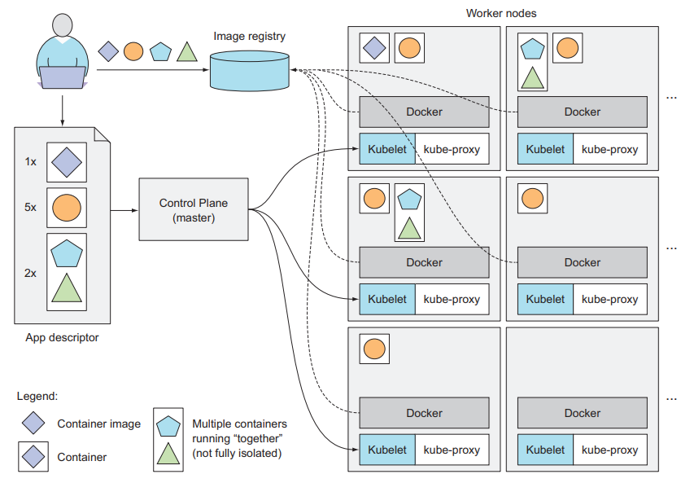

# Chapter 1 - Introducing Kubernetes

## 1.1. Understanding the need for a system like Kubernetes

### 1.1.1. Moving from monolithic apps to microvervices

Microservices communicate through
- Synchronous protocols: HTTP, RESTful (Representational State Transfer) APIs
- Asynchronous protocols: such as AMQP (Advanced Message Queueing Protocol)

**SCALING MICROSERVICES** - only those services that require more resources

**DEPLOYING MICROSERVICES**

> Drawbacks: number of inter-dependencies between the components increases

Debug and trace execution calls: Using distributed tracing systems such as Zipkin

The bigger the number of components you need to deploy on the same host, the harder it will be to manage all their dependencies to satisfy all their requirements

### 1.1.2. Providing a consistent environment to applications

It would be ideal if applications could run in the exact same environment during development and in production so they have the exact same operating system, libraries, system configuration, networking environment, and everything els

### 1.1.3. Moving to continuous delivery: DevOps and NoOps

- Developers: creating new features and improving the user experience, don’t normally want to be the ones making sure that the underlying operating system is up to date with all the security patches and things like that

- Ops team: care about system security, utilization, and other aspects that aren’t a high priority for developers. The ops people don’t want to deal with the implicit interdependencies of all the application components and don’t want to think about how changes to either the underlying operating system or the infrastructure can affect the operation of the application as a whole, but they must

> Kubernetes enables us to achieve all of this. By abstracting away the actual hardware and exposing it as a single platform for deploying and running apps, it allows developers to configure and deploy their applications without any help from the sysadmins and allows the sysadmins to focus on keeping the underlying infrastructure up and running, while not having to know anything about the actual applications running on top of it

## 1.2. Introducing container technologies

Kubernetes uses Linux container technologies to provide isolation of running applications

### 1.2.1. Understanding what containers are

VM Problem: wasting hardware resources + needs to be configured and managed individually = wasting human resources

**ISOLATING COMPONENTS WITH LINUX CONTAINER TECHNOLOGIES**

Using Linux container technologies: run multiple services on the same host machine, while not only exposing a different environment to each of them, but also isolating them from each other, similarly to VMs, but with much less overhead

A process running in a container runs inside the host's operating system, but the process in the container is still isolated from other processes

**COMPARING VIRTUAL MACHINES TO CONTAINERS**

Containers are much more lightweight
- VM needs to run its own set of system processes which requires additional compute resources
- Container is nothing more than a single isolated process running in the host OS, consuming only the resources that the app contumes

**INTRODUCING THE MECHANISMS THAT MAKE CONTAINER ISOLATION POSSIBLE**

- _Linux Namespaces_ - Makes sure each process sees its own personal view of the system (files, processes, network interfaces, hostname, ...)
- _Linux Conttrol Groups (cgroups)_ - Limit the amount of resources the process can consume (CPU, memory, network bandwidth, ...)

**ISOLATING PROCESSES WITH LINUX NAMESPACES**

All system resources, such as filesystems, process IDs, user IDs, network interfaces, and others, belong to the single namespace (You can create additional namespaces and organize resources across them)

Multiple kinds of namespaces exist, so a process doesn't belong to one namespace, but to one namespace of each kind
- Mount (mnt)
- Process ID (pid)
- Network (net)
- Inter-process communication (ipc)
- UTS (About hostname and domain name)
- User ID (user)

**LIMITING RESOURCES AVAILABLE TO A PROCESS**

Cgroups limits the resource usage of a process (or a group of processes)

### 1.2.2. Introducing the Docker container platform

A big difference between Docker-based container images and VM images is that container images are composed of layers, which can be shared and reused across multiple images

**UNDERSTANDING DOCKER CONCEPTS**

Three main concepts in Docker
- _Images_ - A Docker-based container image is something you package your application and its environment into
- _Registries_ - A Docker Registry is a repository that stores your Docker images and facilitates easy sharing os those images between different people and computers
- _Containers_ - A Docker-based container is a regular Linux container created from a Docker-based container image

> It should also be clear that a containerized app built for a specific hardware architecture can only run on other machines that have the same architecture. You can’t containerize an application built for the x86 architecture and expect it to run on an ARM-based machine because it also runs Docker. You still need a VM for that

### 1.2.3. Introducing rkt - an alternative to Docker

SKIP

## 1.3. Introducing Kubernetes

### 1.3.1. Understanding its origins

### 1.3.2. Looking at Kubernetes from the top of a mountain

Kubernetes abstracts away the underlying infrastructure and simplifies development, deployment, and management for both development and the operations teams

**UNDERSTANDING THE CORE OF WHAT KUBERNETES DOES**

The developer can specify that certain apps must run together and Kubernetes will deploy them on the same worker node. Others will be spread around the cluster, but they can talk to each other in the same way, regardless of where they’re deployed

### 1.3.3. Understanding the architecture of a Kubernetes cluster

At the hardware level, a Kubernetes cluster is composed of many nodes, which can be split into two types
- The _master_ node, which hosts the _Kubernetes Control Plane_ that controls and manages the whole Kubernetes system
- _Worker_ nodes that run the actual application you deploy

**THE CONTROL PLANE** - Controls the cluster and makes it function. It consists of multiple components that can run on a single master node or be split across multiple nodes and replicated to ensure high acailability

- The _Kubernetes API Server_, which you and the other Control Plane components communicate with (if replicate)
- The _Scheduler_: Schedules - Assigns a worker node to each deployable component of your application
- The _Controller Manager_ performs cluster-level functions, such as replicating components, keeping track of worker nodes, handling node failures, ...
- _etcd_ - a reliable distributed data store that persistently stores the cluster configuration

> The components of the Control Plane hold and control the state of the cluster, but they don't run your application. This is done by the (worker) nodes

**THE NODES** - The worker nodes are the machines that run your containerized applications. The task of running, monitoring, and providing services to your application is done by the following components

- Docker, or another _container runtime_, which runs your containers
- The _Kubelet_ - talks to API server and manages containers on its node
- The _Kubernetes Service Proxy (kube-proxy)_ which load-balances network traffic between application components

> We’ll explain all these components in detail in chapter 11. I’m not a fan of explaining how things work before first explaining what something does and teaching people to use it. It’s like learning to drive a car. You don’t want to know what’s under the hood. You first want to learn how to drive it from point A to point B. Only after you learn how to do that do you become interested in how a car makes that possible. After all, knowing what’s under the hood may someday help you get the car moving again after it breaks down and leaves you stranded at the side of the road. - Well said bro

### 1.3.4. Running an application in Kubernetes

Package it up into one or more container images, push those images to an image registry, and then post a description of your app to the Kubernetes API server

The description includes:
- The container image or images that contain you application components
- How those components are related to each other, which ones need to be run co-located (together on the same node) and which don't
- How many copies (or _replicas_) for each component
- Which of those components provide a service to either internal or external clients and should be exposed through a single IP address and made discoverable to the other components

**UNDERSTANDING HOW THE DESCRIPTION RESULTS IN A RUNNING CONTAINER**

When the API server processes your app's description
- Scheduler schedules the specified groups of container onto the available worker nodes (based on computational resources required by each group and the unallocated resources on each node at that moment)
- Kubelet on those nodes instructs the Container Runtime to pull the required container images and run the containers

**KEEPING THE CONTAINERS RUNNING**

Once the application is running, Kubernetes continuously makes sure that the deployed state of the application always matches the description you provided

> Similarly, if a whole worker node dies or becomes inaccessible, Kubernetes will select new nodes for all the containers that were running on the node and run them on the newly selected nodes.

**SCALING THE NUMBER OF COPIES**

While the application is running, you can decide you want to increase or decrease the number of copies, and Kubernetes will spin up additional ones or stop the excess ones, respectively. You can even leave the job of deciding the optimal number of copies to Kubernetes. It can automatically keep adjusting the number, based on real-time metrics, such as CPU load, memory consumption, queries per second, or any other metric your app exposes

**HITTING A MOVING TARGET**

To allow clients to easily find containers that provide a specific service, you can tell Kubernetes which containers provide the same service and Kubernetes will expose all of them at a single static IP address and expose that address to all applications running in the cluster

The kube-proxy will make sure connections to the service are load balanced across all the containers that provide the service. The IP address of the service stays constant, so clients can always connect to its containers, even when they're moved around the cluster

### 1.3.5. Understanding the benefits of using Kubernetes

**SIMPLIFYING APPLICATION DEPLOYMENT**

**ACHIEVING BETTER UTILIZATION OF HARDWARE**

When you tell Kubernetes to run your application, you’re letting it choose the most appropriate node to run your application on based on the description of the application’s resource requirements and the available resources on each node

> The app is allowed to freely move around the cluster, ensures the node's hardware resources are utilized as best as possible

**HEALTH CHECKING AND SELF-HEALING**

Kubernetes monitors your app components and the nodes they run on and automatically reschedules them to other nodes in the event of a node failure

**AUTOMATIC SCALING**

**SIMPLIFYING APPLICATION DEVELOPMENT**

## 1.4. Summary

