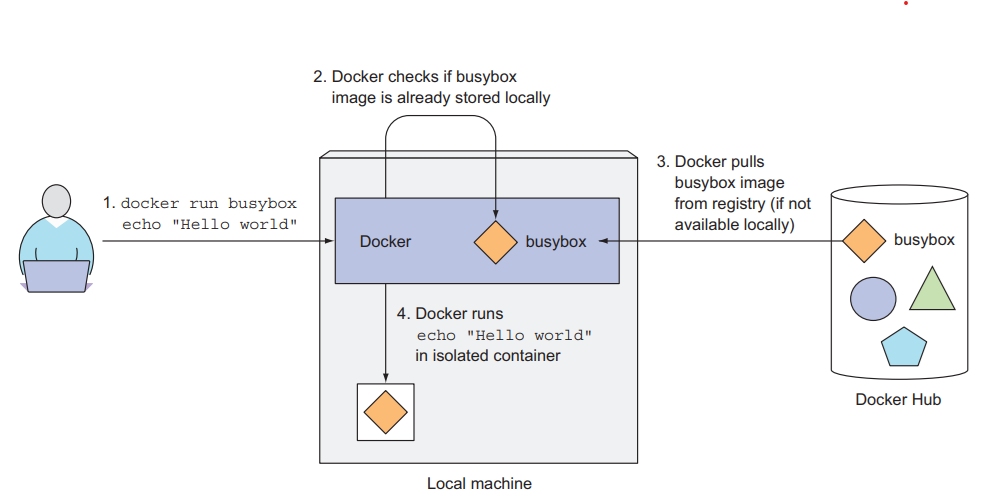

# Chapter 2 - First steps with Docker and Kubernetes

## 2.1. Creating, running, and sharing a container image

1. Install Docker and run your first "Hello world" container
2. Create a trivial Node.js app that you'll later deploy in Kubernetes
3. Package the app into a container image so you can then run it as an isolated container
4. Run a container based on the image
5. Puch the image to Docker Hub so that anyone anywhere can run it

### 2.2.1. Installing Docker and running a Hello World container

**RUNNING A HELLO WORLD CONTAINER**

    docker run busybox echo "Hello world"

**UNDERSTANDING WHAT HAPPENS BEHIND THE SCENES**

**RUNNING OTHER IMAGES**

    docker run <image>

**VERSIONING CONTAINER IMAGES**

    docker run <image>:<tag>

### 2.1.2. Creating a trivial Node.js app

[🥩App.js](trivial-app/app.js)

### 2.1.3. Creating a Dockerfile for the image

[🐋Dockerfile](trivial-app/Dockerfile)

### 2.1.4. Building the container image

    // inside ./trivial-app
    docker build -t kubia .