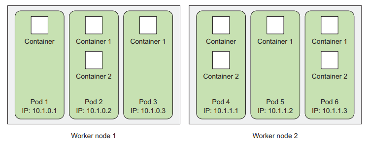
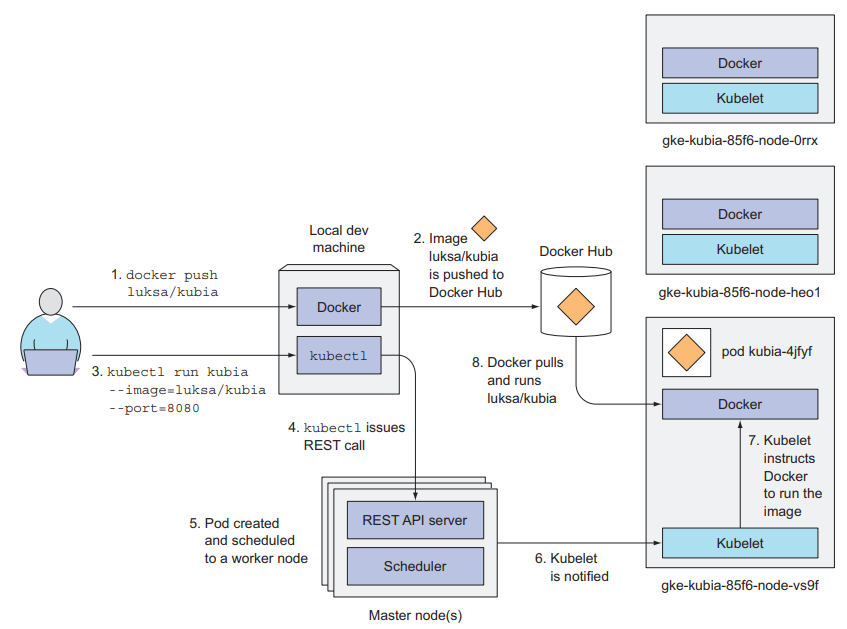
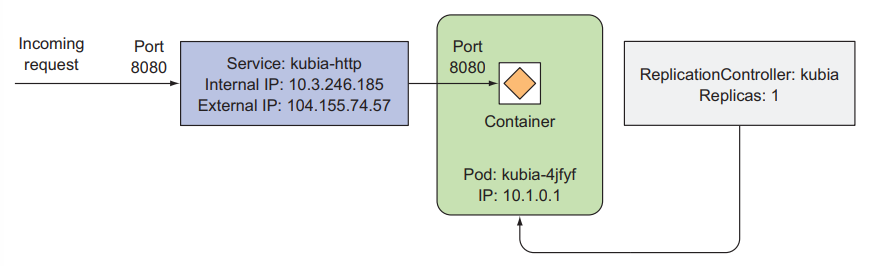
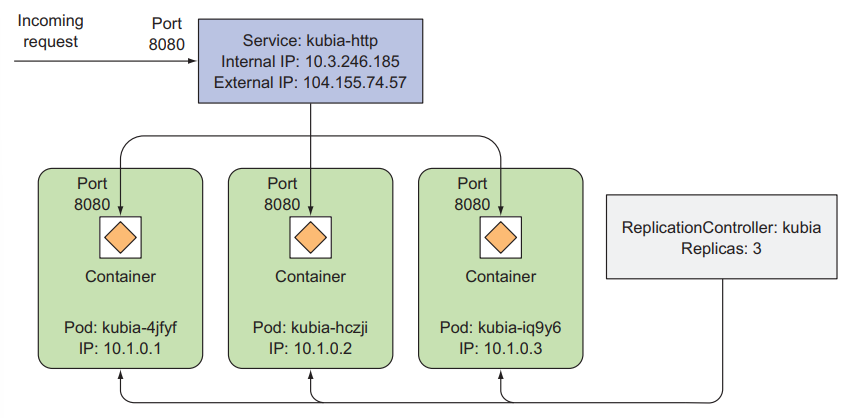

# Chapter 2 - First steps with Docker and Kubernetes

## 2.1. Creating, running, and sharing a container image

1. Install Docker and run your first "Hello world" container
2. Create a trivial Node.js app that you'll later deploy in Kubernetes
3. Package the app into a container image so you can then run it as an isolated container
4. Run a container based on the image
5. Puch the image to Docker Hub so that anyone anywhere can run it

### 2.2.1. Installing Docker and running a Hello World container

**RUNNING A HELLO WORLD CONTAINER**

    docker run busybox echo "Hello world"

**UNDERSTANDING WHAT HAPPENS BEHIND THE SCENES**

**RUNNING OTHER IMAGES**

    docker run <image>

**VERSIONING CONTAINER IMAGES**

    docker run <image>:<tag>

### 2.1.2. Creating a trivial Node.js app

[🥩App.js](trivial-app/app.js)

### 2.1.3. Creating a Dockerfile for the image

[🐋Dockerfile](trivial-app/Dockerfile)

### 2.1.4. Building the container image

    // inside ./trivial-app
    docker build -t kubia .

## 2.2. Setting up a Kubernetes cluster

A proper Kubernetes install spans multiple physical or virtual machines and requires the networking to be set up properly, so that all the containers running inside the Kubernetes cluster can connect to each other through the same flat networking space

### 2.2.1. Running a local single-node Kubernetes cluster with Minikube

**INSTALLING MINIKUBE**

[Instruction](http://github.com/kubernetes/minikube)

**STARTING A KUBERNETES CLUSTER WITH MINIKUBE**

    minikube start

**INSTALLING THE KUBERNETES CLIENT (KUBECTL)**

**CHECKING TO SEE THE CLUSTER IS UP AND KUBECTL CAN TALK TO IT**

    kubectl cluster-info

> You can run `minikube ssh` to log into the Minikube VM and explore it from the inside

### 2.2.2. Using a hosted Kubernetes cluster with Google Kubernetes Engine

**CHECKING IF THE CLUSTER IS UP BY LISTING CLUSTER NODES**

    kubectl get nodes

**RETRIEVING ADDITIONAL DETAILS OF AN OBJECT**

    kubectl describe node <node>

## 2.3. Running your first app on Kubernetes

Usually, you’d prepare a JSON or YAML manifest, containing a description of all the components you want to deploy, but because we haven’t talked about the types of components you can create in Kubernetes yet, you’ll use a simple one-line command to get something running

### 2.3.1. Deploying your Node.js app

Using `kubectl run` command

    $ kubectl run kubia --image=luksa/kubia --port=8080 --generator=run/v1
    replicationcontroller "kubia" created

`--image=luksa/kubia` specifies the container image you want to run, `--port=8080` tells Kubernetes that your app is listening to port 8080, `--generator=run/v1` tells Kubernetes to create a _ReplicationController_
instead of a _Deployment_ (later)

**INTRODUCING PODS**

A pod is a group of one or more tightly related containers that will always run together on the same worker node and in the same Linux namespace(s)

**LISTING PODS**

> kubectl get pods

**UNDERSTANDING WHAT HAPPENED BEHIND THE SCENES**

### 2.3.2. Accessing your web application

Each pods get its own IP address, but this address is internal to the cluster and isn’t accessible from outside of it

> Need to expose it through a Service object - type `LoadBalancer`

By creating a LoadBalancer-type service, an external load balancer will be created and you can connect to the pod through the load balancer’s public IP

**CREATING A SERVICE OBJECT**

Expose the ReplicationController

    $ kubectl expose rc kubia --type=LoadBalancer --name kubia-http
    service "kubia-http" exposed

**LISTING SERVICES**

    $ kubectl get services
    NAME        CLUSTER-IP      EXTERNAL-IP     PORT(S)         AGE
    kubernetes  10.3.240.1      <none>          443/TCP         35m
    kubia-http  10.3.246.185    104.155.74.57   8080:31348/TCP  1m

Your application is now accessible at http://104.155.74.57:8080 from anywhere in the world

> Minikube doesn’t support LoadBalancer services, so the service will never get an external IP. But you can access the service anyway through its external port - get from `minikube service kubia-http`

### 2.3.3. The logical parts of your system

**UNDERSTANDING HOW THE REPLICATIONCONTROLLER, THE POD, AND THE SERVICE FIT TOGETHER**

By running the `kubectk run` command you created a ReplicationController, and this ReplicationController is what created the actual Pod object

> To make that pod accessible from outside the cluster, you told Kubernetes to expose all the pods managed by that ReplicationController as a single Service

**UNDERSTANDING THE POD AND ITS CONTAINER**

A pod can contain as many containers as you want. The pod has its own unique private IP address and hostname

**UNDERSTANDING THE ROLE OF THE REPLICATIONCONTROLLER**

(In our case)It makes sure there’s always exactly one instance of your pod running. Generally, ReplicationControllers are used to replicate pods (that is, create multiple copies of a pod) and keep them running

**UNDERSTANDING WHY YOU NEED A SERVICE**

A pod may disappear at any time—because the node it’s running on has failed, because someone deleted the pod, or because the pod was evicted from an otherwise healthy node. When any of those occurs, a missing pod is replaced with a new one by the ReplicationController, as described previously. This new pod gets a different IP address from the pod it’s replacing. This is where services come in—to solve the problem of ever-changing pod IP addresses, as well as exposing multiple pods at a single constant IP and port pair

When a service is created, it gets a static IP, which never changes during the lifetime of the service. Instead of connecting to pods directly, clients should connect to the service through its constant IP address. The service makes sure one of the pods receives the connection, regardless of where the pod is currently running (and what its IP address is)

_Horizontally scaling the application_

Check ReplicationController

    $ kubectl get replicationcontrollers
    NAME    DESIRED     CURRENT     AGE
    kubia   1           1           17m

The `DESIRED` column shows the number of pod replicas you want the ReplicationController to keep, whereas the `CURRENT` column shows the actual number of pods currently running

> You can get a list of all the possible object types by invoking kubectl get without specifying the type

**INCREASING THE DESIRED REPLICA COUNT**

To scale up the number of replicas of your pod, you need to change the desired replica count on the ReplicationController

    $ kubectl scale rc kubia --replicas=3
    replicationcontroller "kubia" scaled

    $ kubectl get pods
    NAME            READY   STATUS      RESTARTS    AGE
    kubia-hczji     1/1     Running     0           7s
    kubia-iq9y6     0/1     Pending     0           7s
    kubia-4jfyf     1/1     Running     0           18m

**SEEING REQUESTS HIT ALL THREE PODS WHEN HITTING THE SERVICE**

    $ curl 104.155.74.57:8080
    You’ve hit kubia-hczji
    $ curl 104.155.74.57:8080
    You’ve hit kubia-iq9y6
    $ curl 104.155.74.57:8080
    You’ve hit kubia-iq9y6
    $ curl 104.155.74.57:8080
    You’ve hit kubia-4jfyf 

Requests are hitting different pods randomly. This is what services in Kubernetes do when more than one pod instance backs them. They act as a load balancer standing in front of multiple pods

**VISUALIZING THE NEW STATE OF YOUR SYSTEM**

### 2.3.5. Examining what nodes your app is running on
