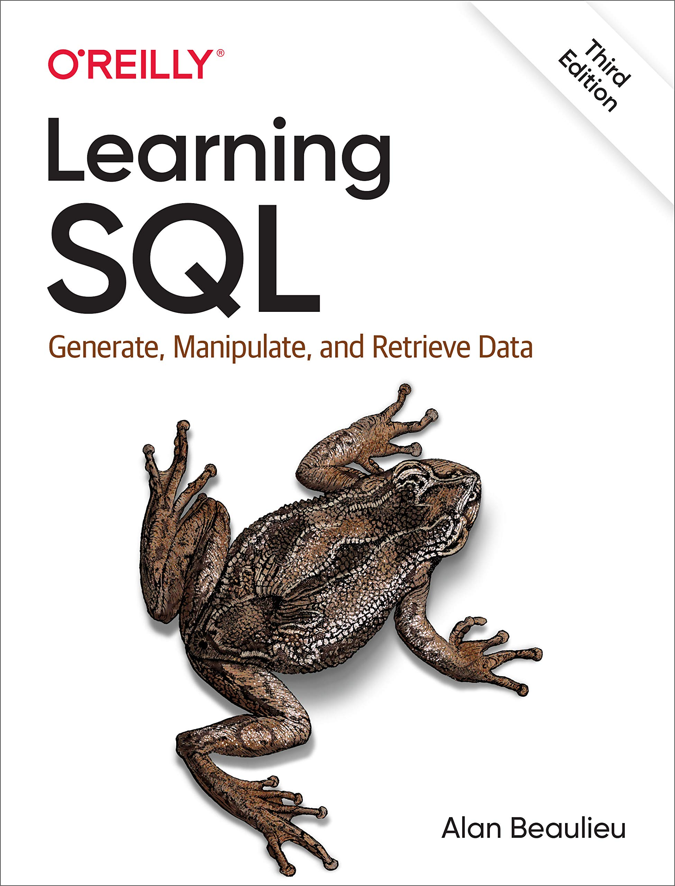
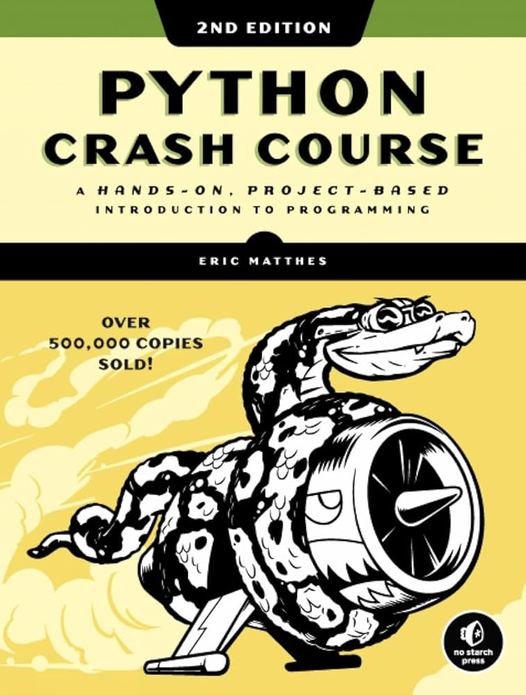
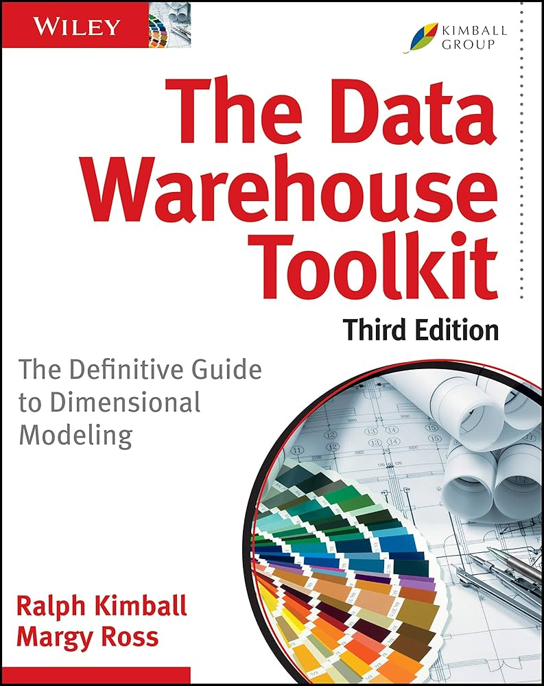
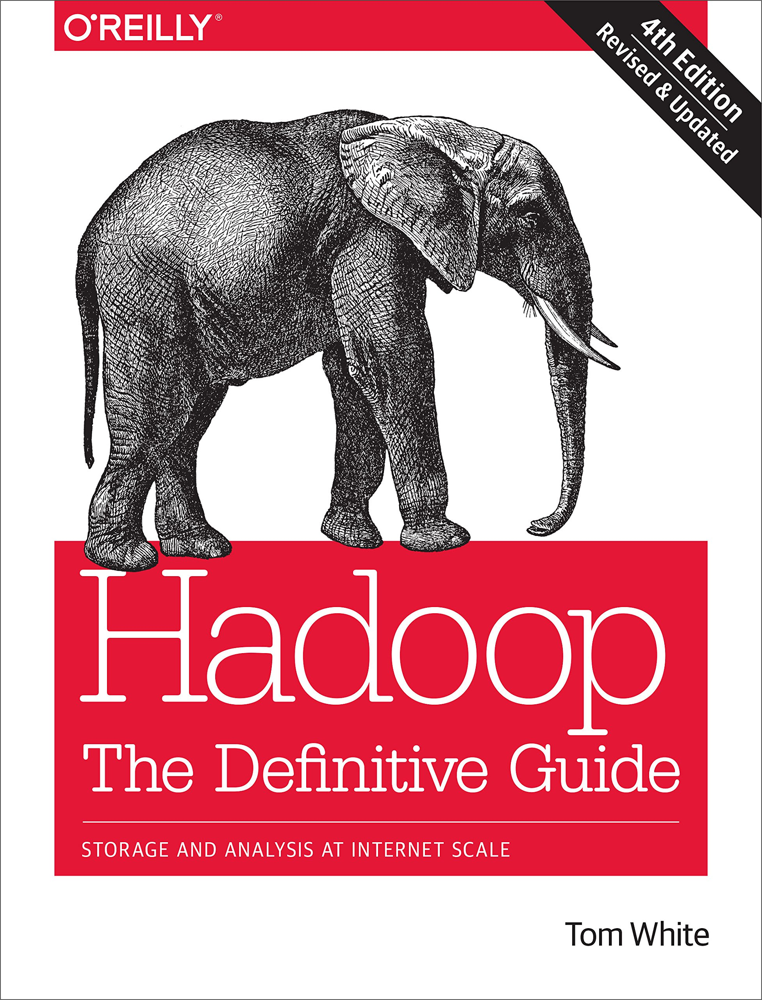
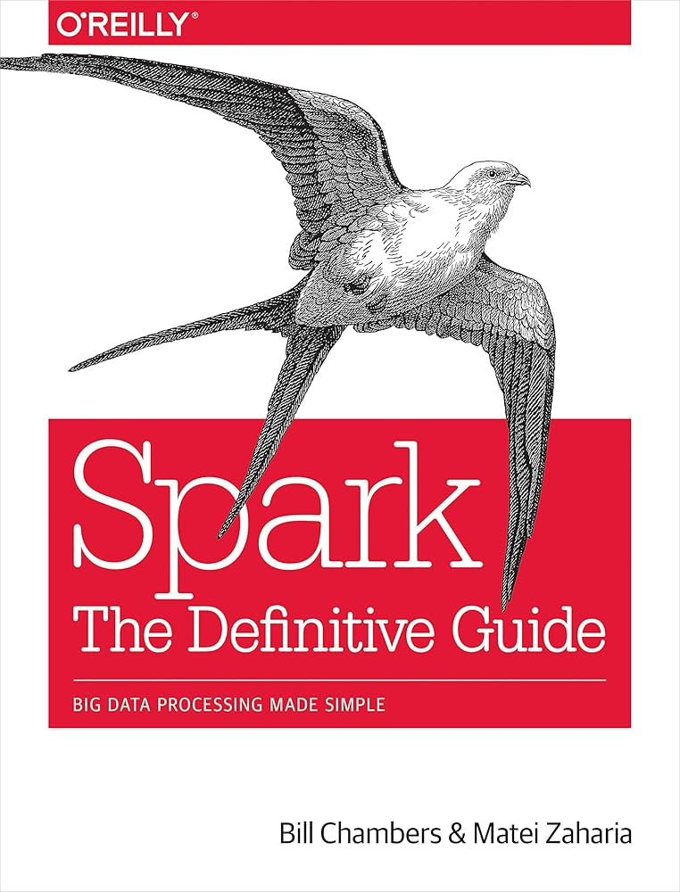
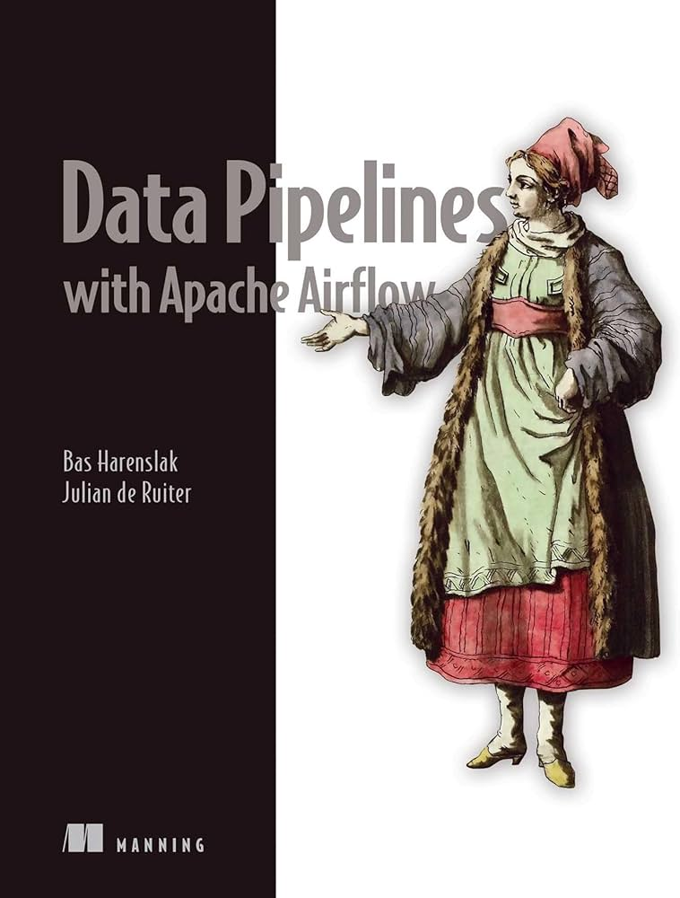
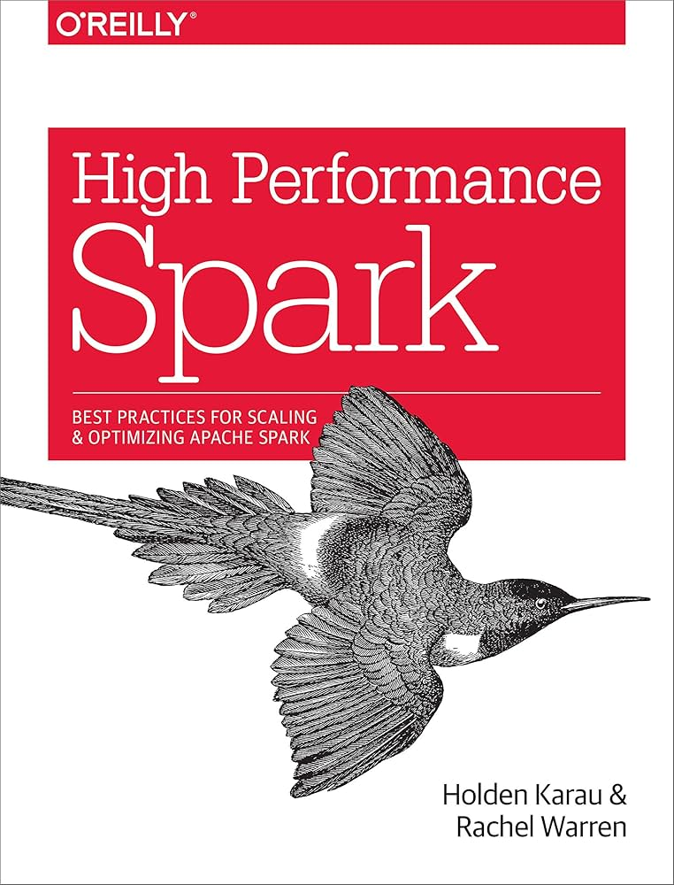

# Data Engineer Self-Notebook

Notes for some Data Engineering Book

1. Learning SQL - Generate, Manipulate, and Retrieve Data by Alan Beaulieu 

    

2. Python Crash Course, 2nd Edition: A Hands-On, Project-Based Introduction to Programming by Eric Matthes

    

3. The Data Warehouse Toolkit: The Definitive Guide to Dimensional Modeling by Ralph Kimball

    
    
4. Hadoop The Definitive Guide: Storage and Analysis at Internet Scale by Tom White

    
    
5. Spark The Definitive Guide: Big Data Processing Made Simple

    

6. Data Pipelines with Apache Airflow

    

7. High Performance Spark: Best Practices for Scaling & Optimizing Apache Spark

    
